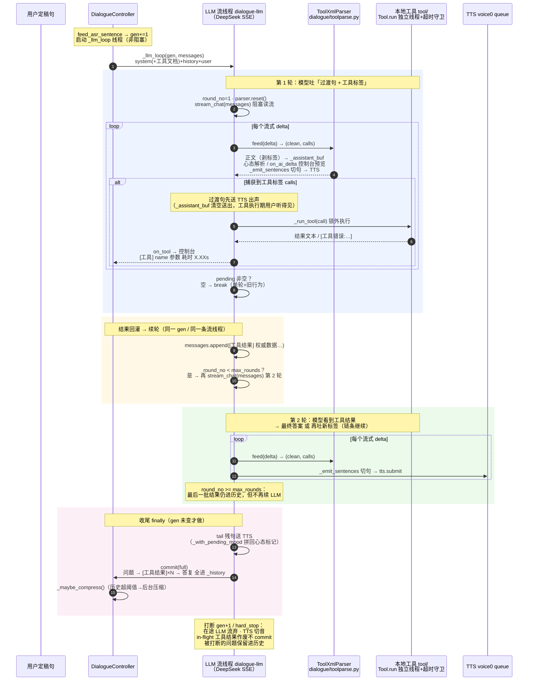

# LLM 模式工具调用（XML 内联）设计 —— 参照 Alife XmlFunctionCaller

> 状态：**已实现（2026-09-16）**。目标是让 `--brain llm`（DeepSeek 直连，首 token ~0.5s）在保持速度
> 的前提下获得"自由接入各种工具"的能力，弥补 agent 模式（本地 claude CLI → 方舟 ark-code-latest，
> 首 token 实测 4~8s）太慢的问题。
>
> 工具包放仓库根 **`tool/`**（用户拍板：独立顶层文件夹，非 `dialogue/tools/`）。
> 配套 headless 测试 `tmp/test_llm_tools.py`（解析器单元 / 假 LLM 两轮流 / 安全阀 / 默认关零变化）。
>
> 参考实现：Alife（https://github.com/BDFFZI/Alife）`Alife.Function.FunctionCaller`
> （`XmlFunctionCaller.cs` / `XmlStreamParser.cs` / `XmlStreamExecutor.cs` / `XmlHandler.cs`）
> 与 `Alife.Function.Language.OpenAI` 的 `OpenAILanguageModel.cs`。

## 1. 背景与动机

| | LLM 模式（现状） | agent 模式（现状） |
|---|---|---|
| 链路 | DeepSeek 直连，OpenAI 兼容流式 | 本地 claude CLI（SDK）→ 方舟 ark-code-latest |
| 首 token | **0.42~0.75s**（2026-09 实测） | **4~8s**（会话实测，高峰更高） |
| 工具调用 | ❌ 无 | ✅ 有（claude 原生 agent 工具 + MCP + 技能） |
| 是否离线 | LLM 在线（DeepSeek API） | CLI 在线（方舟） |

目标：**给 LLM 模式补上工具能力，同时保住它的速度**——纯 OpenAI 兼容流式 + 内联 XML 工具调用，
不做任何 agentic 编排。

## 2. Alife 为什么"快 + 能调工具"（四个要素）

1. **LLM 就是纯流式对话**（`OpenAILanguageModel.cs`：SemanticKernel `ChatCompletionAgent` +
   `InvokeStreamingAsync`，可接 DeepSeek）。没有任何 agent 循环、权限确认、子进程编排。
2. **工具不走原生 `tool_calls` 两轮请求**，而是把工具文档注入系统提示词，让模型在**输出文本流里
   直接写 XML 标签**：`好的，我来查一下<get_weather city="北京"/>`。
3. **字符级流式 XML 解析器**（`XmlStreamParser.cs` 状态机：普通文本 / 标签 / 属性 / 转义 / 注释），
   标签一闭合（`XmlStreamExecutor.cs`）**立即执行本地工具**，毫秒级。
4. **模型能"边说话边干活"**：工具标签前的过渡句已经流式播出，用户立刻有声音反馈，工具在后台跑；
   结果经 `interactor.Poke()` 0.5s 去抖后追加为一条 user 消息 → 发起第二段流式 → 最终答案。

速度细节（加分项，非必需）：`SocketsHttpHandler` 连接池（5min lifetime，免每次 TLS 握手）；
双档模型（`chatCompletionAgentNotThinking` 平时用，`thinkingRequester` 被工具轮占用时才切
带 reasoning 的档）。

## 3. 核心疑问：工具结果是否需要二次送 LLM？

**需要。Alife 是明确的两轮流式，不是单轮内联注入。**

```
第 1 轮  用户问题 ──→ LLM 流式：过渡句"好的我来查一下" + <get_weather city="北京"/>
        过渡句已送 TTS 出声 ←──────────────────────────┐
        解析器捕获标签 → 本地执行工具（毫秒级）           │
第 1 轮流结束                                          │
        ↓ 结果回灌：追加 user 消息 [来自系统的杂项消息推送] 北京 晴 25度
第 2 轮  LLM 看到结果 → 流式最终答案"北京今天晴 25度" ←───┘
```

为什么必须两轮：
- 模型无法预知**本地工具**的返回值——答案必须等工具执行完才有；
- 流式 API 不支持中途注入结果文本；
- 所以 Alife 用"可靠的两轮"，但感知代价几乎为零：每轮都是 0.5s 首 token 的纯流式，且
  **第 1 轮过渡句已出声**，第 2 轮的等待被"正在说话"掩盖，语音上不觉得是两轮。

> 澄清：`XmlFunctionCaller.OnChatFinishedAsync` 里的 `WaitToInactive` 是等工具执行器排空，
> **不是**把结果缝进当前流。

## 4. voice1 方案总览

```
--brain llm（DeepSeek 直连，链路不动）
   │
   ├── 工具注册表 tool/                    （Tool / @tool / 包内自动扫描，仓库根独立顶层包）
   ├── 提示词注入（启用时 system 追加 XML 工具文档）
   ├── XML 流式解析器 dialogue/toolparse.py（Alife XmlStreamParser 移植）
   ├── controller._llm_loop 多轮循环        （边流边解析 → 执行工具 → 结果回灌 → 续轮）
   └── 安全阀（轮数上限 / 超时 / 结果截断 / 异常回灌）
```

**核心不变式**：不启用 `--tools` 时，`_llm_loop` 行为与现在**完全一致**（单轮流式、零解析、
零注入）——旧功能零衰退。

## 5. 组件设计

### 5.1 工具注册表（可插拔）—— `tool/`（仓库根独立顶层包）

```python
# tool/base.py
@dataclass
class Tool:
    name: str                    # XML 标签名（小写，如 get_weather）
    description: str             # 一行简介（进提示词）
    params: dict[str, str]       # 参数名 -> "类型 说明"（"[可选]" 后缀表可选）
    explanation: str = ""        # 详细用法说明（可选，进提示词）
    present: str = ""            # 结果"呈现方式"指令（可选）：结果是**用户要听的内容本身**
                                 # （笑话/故事）而非"待摘要的数据"时填 → [工具结果] 注入带它、
                                 # 覆盖通用"不要复述"，强制模型完整逐字讲（2026-09-19 实测
                                 # DeepSeek 把笑话压成一句评论）。数据类工具留空走默认。
    timeout: float = 10.0        # 执行超时（防语音流卡死）
    max_result: int = 800        # 结果最长字符（防爆上下文）
    fn: Callable[[dict], str]    # params -> 结果字符串（必须快、纯函数优先）

@tool(name, description, params_dict, explanation=..., present=..., timeout=..., max_result=...)  # 装饰器
```

```python
# tool/weather.py —— 用户加工具 = 丢一个 py 文件到 tool/，零改码
@tool("get_weather", "查询天气", {"city": "[可选] 城市名，如 北京"},
      explanation="...", timeout=15.0, max_result=1200)
def get_weather(params: dict) -> str:
    return _query(city, days)   # 返回纯文本结果；任何失败返回可读错误文本，绝不抛异常
```

- `tool/__init__.py` 用 `pkgutil.iter_modules` 扫描包内所有模块，收集每个模块里的
  `Tool` 实例（装饰器自动注册），**新增工具 = 丢一个 py 文件**（与 Alife Module 自动发现
  同思路、更轻）。
- 启动时按 `--tools all|名字列表` 过滤加载，打印已加载清单；未知名字打印警告跳过。
- 工具执行在**独立线程 + timeout 守卫**（防某工具挂死拖住 LLM 流线程；默认 10s，超时回灌
  `[工具错误: 超时]`），结果按 `max_result` 截断。

### 5.2 提示词注入

启用工具时，`_build_messages_locked` 的 system 末尾追加（照 Alife `UpdatePrompt` 精简）：

```
## 工具调用
你可以通过输出 XML 标签调用工具来获取实时信息：
- 调用方式：<工具名 参数="值"/>（自闭合）。可一次调用多个。
- 可用工具：
  - <get_weather city="北京"/> : 查询天气
  - <get_time/> : 获取当前时间
- 调用前先说一句过渡语（用户听得到），然后输出标签，等收到 [工具结果] 后继续回答。
- **说到就要做到（2026-09-20 实测补）**：只要说"我去查一下/帮你看看/稍等"这类要查数据的
  过渡语，这一轮**必须**紧跟着输出对应的工具标签并调用，绝不能只说过渡语就结束回答——
  查询类问题一律要调用工具拿到真实结果后再答（实测：模型只回"我这就去帮你看看今天的
  金价"就停、没调工具，人格"说话要短"与"可调工具"叠加导致）。
- 注意：& < > 等字符要用 &amp; &lt; &gt; 转义；标签本身不会被用户听到。
- 补充（2026-09-16 实测补）：每轮对话都可以调用工具，且可以随时再次调用——用户追问新日期/
  新城市等此前结果没覆盖的信息时，重新调用对应工具获取，不要用旧结果硬答、也不要说
  "没有数据/查不到"。`get_weather` 默认取整周 7 天，用户追问后面几天不用重查就能答。
- 补充（2026-09-16 重复回答实测）：工具结果注入消息与 system 都声明「结果里的数据是**权威
  事实**，据此**一次说清**，不要重复/复述，不要编造数据里没有的数字」——曾实测 DeepSeek 在
  单次输出里重复回答两版且自相矛盾（30/23 有小雨 vs 30/22 不下雨，后者是臆造）。
- **`present` 例外（2026-09-19 笑话实测补）**：带 `present` 的工具（`get_soviet_joke`）结果
  **不是"待摘要的数据"而是"用户要听的内容本身"**——「不要重复/复述」对它反效果（实测
  DeepSeek 把笑话原文压成一句评论"这个太损了…"）。注入消息里改带该工具的呈现要求（完整
  逐字讲、可加一句过渡、不许另编），并覆盖通用「不要重复」；「不要编造」对所有工具保留。
  `_tools_prompt` 的工具文档同步显示 `[呈现要求]` 行，模型调用前就知道该工具的结果要照搬。
```

### 5.3 XML 流式解析器 —— `dialogue/toolparse.py`

移植 Alife `XmlStreamParser`（字符级状态机）：
- 状态：普通文本 / 标签解析 / 属性名 / 属性值 / 转义（`&...;`）/ 注释（`<!-- -->`）。
- `feed(delta) -> (clean_text, calls)`：喂一段增量，返回**剥掉标签的正文**与本次完整闭合的
  `ToolCall(name, attrs, raw)` 列表（边流边解析，跨 delta 拆分天然正确）。
- `flush()` 收尾：未闭合的工具标签**不执行**（attrs 可能不完整），残留正文按容器透明处理。
- 规则：已知工具自闭合 `<name/>` 或成对 `<name>…</name>` → 产 `ToolCall`，标签本身不进正文
  （成对工具标签内部文本丢弃）；**未知成对标签** → 透明容器（内部文本保留为正文，如
  `<answer>…</answer>`）；未知自闭合/注释 → 整个丢弃；实体 `&amp;` `&#34;` 等 → 解码进
  正文/属性值。
- 心态标记 `【心态：xxx】` 是普通文本（无尖括号），原样通过。
- 与现有流式出字解耦：解析器只认标签，正文仍走原 `_assistant_buf` 管线。

### 5.4 控制器集成 —— `_llm_loop` 多轮循环

```
现状：
  for delta in stream_chat(messages): buf+=delta; ...心态/切句...
  finally: commit(full)

改造（启用 --tools 时）：
  round = 0
  while round < max_rounds:                       # 默认 3
      round += 1
      parser.reset()
      for delta in stream_chat(messages):
          if gen != self._gen: return             # 原打断守卫不动
          clean, calls = parser.feed(delta)       # 边流边解析：剥标签 + 收调用
          buf += clean                            # 标签剥掉不进正文/TTS
          ...心态/切句/TTS 全不动...
          if calls:                               # 工具标签一闭合立即执行
              flush 过渡句到 TTS（工具执行前先出声，用户立刻有反馈）
              pending += [exec_tool(c) for c in calls]   # 同步执行 + 超时守卫
      if not pending: break                       # 没调工具 = 单轮 = 旧行为
      messages.append({"role":"user","content":"[工具结果]\n"+"\n".join(pending)})
      pending = []                                # 下一轮继续
  finally: commit(full)                           # 正文已含过渡句+最终答案
```

要点：
- **续轮不重新 `_launch_llm`**：在 `_llm_loop` 内部对本地 `messages` 追加结果再 `stream_chat`，
  同一个 gen、同一条流线程——barge-in/post-commit/回声门控把整轮（含工具续轮）看作一轮，
  语义正确。
- **过渡句先出声（关键）**：LLM 路径的 `_find_cut` 只在标点/心态闭合/硬上限切句、**不**在
  语气词切——工具标签捕获时若累积缓冲里有过渡句而不显式送 TTS，用户在整个工具执行期间
  听不到任何声音。修法：捕获调用瞬间把 `_assistant_buf` 清空送 TTS（`_with_pending_mood`
  保心态标记），再执行工具。
- **结果回灌轮不重复过渡（2026-09-19 实测两段过渡后补齐根因）**：过渡句先出声后，模型拿到
  `[工具结果]` 常又自己开场一遍（"好呀…给你讲一个"+"阿阳想听笑话呀…"两段重复）。**根因是
  续轮上下文漏喂**：第 2 轮发给 LLM 的消息只有 `[工具结果]` user 消息、没有第 1 轮助手正文，
  模型不知道自己已开过场——纯"别重复"禁令拦不住（DeepSeek 实测照样重开）。
  修法分两层：
  - **根因（OpenAI 工具轮同款协议）**：续轮前 `round1_assistant = _assistant_full.strip()`
    → 以 `{"role":"assistant","content":...}` append 进 messages（在 `[工具结果]` user
    消息**之前**）——模型看见自己已说过的过渡句，拿到结果直接续正文；纯 `<get_time/>` 无
    正文不加空 assistant 消息。**写新"工具续轮/多轮"逻辑记得：续轮必须带上轮助手正文当
    assistant 消息**。
  - **双保险（按轮记 pre_transition）**：轮开头记 `round_full0`，工具调用瞬间若
    `_assistant_full` 已有增量 → `pre_transition=True`（过渡句已/将被用户听到），回灌消息才
    注入"调用工具前你已经说过一句过渡语了——拿到结果后**直接开始说内容**，不要再重复一遍
    开场过渡（如“我查一下”“我给你讲一个”）"；纯 `<get_time/>` 无过渡的轮不注入，模型照常
    自己开头。`get_soviet_joke` 的 `present` 同步去掉"可开头加一句过渡"（调用前已说过，直接
    进正文）。
  headless 验证 `tmp/test_llm_tools.py`：section 3/10 断言 `llm.last_messages[-2]` 是
  `assistant` 且含过渡句（"一下哈"/"好呀我给你讲一个"）、`[-1]` 是 `[工具结果]` user 消息；
  笑话轮消息带"开场过渡/不要再重复"，纯标签轮不带。
- 工具结果以 `{"role":"user","content":"[工具结果] ..."}` 进 `_history`（Alife 同款），
  存档/压缩正常包含。
- 工具执行完成经 `on_tool(name, attrs, text, dt, ok)` 回调（主程序控制台打
  `[工具] name 参数 耗时 X.XXs` 诊断行：**参数**（`city="北京"`，无参数显示「（无参数）」）
  + **耗时**（工具实际执行秒数）+ 结果预览；预览限 120 字、**截断加省略号**
  `…（预览截断，完整 N 字已送 LLM）`——真实 `max_result` 截断由 `Tool.run` 加
  `…（结果已截断）`。不占 AI 定稿行）。
- 心态标记机制不动：工具标签不进 `_assistant_full`，正文保留标记。

### 5.5 标签剥离与 TTS 兼容

- `_clean_for_tts` 追加兜底正则 `_TAG_RE = re.compile(r"<[^<>]{1,64}>")` 剥尖括号段，
  防模型吐未知标签被念出来（幂等，同 `_PUNCT_RUN_RE` 的处理位置）。
- 工具标签**不进** `_assistant_buf`/`_assistant_full`/TTS/控制台定稿行；只有正文走原链。
- 过渡句（"好的我来查一下"）照常流式切句送 TTS → 用户立刻听到。

### 5.6 安全阀

| 阀 | 默认 | 说明 |
|---|---|---|
| `--tools-max-rounds` | 3 | 防工具无限循环（工具链过长则放弃续轮，结果进历史不续） |
| `--tools-timeout` | None | 单工具执行超时覆盖（不传用单工具自带，如 get_time=3s / get_weather=15s） |
| `max_result` | 800 字 | 结果截断（单工具可调） |
| 异常 | — | 工具抛异常 → 回灌 `[工具错误: 原因]`，让模型优雅回应 |
| 结果角色 | user | 与 Alife 一致（XML 方案不用原生 tool_calls，不能用 role=tool） |
| 网络代理 | 绕过系统代理直连 | 代码**不写死代理地址**；`load_tools()` 时若**未显式配置** `HTTP_PROXY`/`HTTPS_PROXY` → 设 `NO_PROXY=*` 绕开 Windows 注册表系统代理直连（金价/天气等国内源可达，系统代理进程没跑也不会连不上）；**显式配置了代理环境变量 → 尊重代理**。想走代理就设 `HTTP_PROXY`/`HTTPS_PROXY` 再起程序 |

### 5.7 多轮流时序图（链条式工具调用）

`_llm_loop` 是 `while True` 多轮循环：每轮一次 `stream_chat(messages)`（messages 每轮追加
`[工具结果]` 后复用）——链条式多轮天然支持（如 `get_time → search_flight(date=…) → 答案`），
同一轮吐多个标签也支持（全部执行、合进一条 `[工具结果]`）。



### 5.8 MCP 工具桥接（stdio / streamable HTTP，2026-09-21 已实现）

**问题**：llm+tools 模式只认 `tool/` 的本地 `Tool`（同步 fn + XML 内联标签）；MCP server 是
JSON-RPC（stdio 子进程 / streamable HTTP），SDK 是 asyncio 客户端，无法直接进 `--tools`。
**方案**：桥接层把 MCP server 枚举的工具**转成本方案的 `Tool` 实例**——模型照常写
`<server_工具名 .../>` 标签，`_llm_loop` 照常执行/结果回灌/多轮，DeepSeek 完全不知道背后是
MCP。等价于把「二期 MCP 包装」提前落地。

- **配置**：`tool/mcp.local.json`（**gitignored**，含机器路径/凭据；示例 `tool/mcp.local.example.json`
  入库可抄）。格式与 `.mcp.json` 同款：
  ```json
  { "mcpServers": {
      "search":  { "command": "C:/.../.venv-search/Scripts/python.exe", "args": ["-m", "search_mcp"], "env": {} },
      "weather": { "url": "http://127.0.0.1:8080/mcp" } } }
  ```
  `command` → stdio 子进程；`url` → streamable HTTP（二选一）。配置路径可用环境变量
  `VOICE1_MCP_CONFIG` 覆盖（headless 测试/非默认布局用）。
  **`.mcp.json` 风格字段照常识别**：`disabled: true` 跳过该 server（改配置去掉即启用）；
  `timeout`（秒）作为该 server 工具的执行/调用超时；`env` 透传子进程环境。
  **路径解耦（与 agent.py 同款）**：`command` 为 `python/py/python3/pythonw` → 换成
  本进程解释器 `sys.executable`（避免 PATH 里别的 python 缺 mcp 依赖）；相对 `command`/`args`
  视为相对**仓库根**转绝对路径（跟"从哪启动 voice_dialogue"解耦）；`-m <模块名>` 形态下
  `-m` 后的参数是模块名**不转**。业务 MCP server 脚本惯例放 `tool/mcp_tools/`（如
  `tool/mcp_tools/author.py`），配置里 `args: ["./tool/mcp_tools/author.py"]` 即可。
- **`mcp` 特殊 token**：`--tools mcp` = 只加载 MCP 工具；`--tools all`/不传 = 本地 + MCP 全上
  （`mcp.local.json` 不存在时干净跳过、打一行提示，不影响 `all`）；`--tools get_time,mcp` = 混合。
- **实现**：`tool/mcp_bridge.py`——**一个常驻后台事件循环线程**持有各 server 的
  `ClientSession`（`async with` 保活），`list_tools()` 把每个 MCP 工具的 `input_schema`
  （JSON Schema）转成 `Tool.params`（`[可选]` 前缀表可选，类型 + description），暴露名 =
  `_sanitize(server_工具名)`（非法字符→`_`，数字开头补 `m_`），fn 用
  `asyncio.run_coroutine_threadsafe` 桥到后台循环 `call_tool`，结果格式化：content 的 text 块
  优先、`structuredContent` JSON 兜底、`isError` 转可读错误文本——**绝不抛异常**，模型只见干净
  字符串。`close_mcp_tools()` 优雅断开（置 stop 事件 + cancel + 停循环），幂等、atexit 兜底、
  main finally 接线。
- **mcp SDK 2.x 踩坑（写新 MCP 客户端/服务端代码先看）**：① `ClientSession` **不再在
  `__aenter__` 自动握手**，必须先 `await session.initialize()` 再 `list_tools()`——否则 server
  回 `Invalid request parameters`（实测第一行线上消息就是 tools/list，被拒）；② FastMCP 改名
  `MCPServer`（`from mcp.server.mcpserver import MCPServer`），`@server.add_tool` 装饰器注册、
  `asyncio.run(server.run_stdio_async())` 跑 stdio、`server.run(transport="streamable-http",
  host, port, streamable_http_path)` 跑 HTTP；③ MCP 工具字段是 `input_schema`（不是
  `inputSchema`）；④ 老脚本（mcp 1.x）的 `from mcp.server.fastmcp import FastMCP` /
  `@mcp.tool()` / `mcp.run(transport='stdio')` 三处都要迁（`tool/mcp_tools/author.py` 已迁，
  抄它即可）；⑤ 参数描述要进 schema 得用 `Annotated[str, Field(description=...)]`——裸字符串
  Annotated 元数据 pydantic 忽略。
- **工具包网络策略**：HTTP 型 MCP server 由 `apply_network_policy()` 统一起作用（默认
  `NO_PROXY=*` 直连）；stdio 型是本地子进程，无网络代理问题。

## 6. 参数控制（防旧功能衰退）

- `--tools <名字列表|all|mcp>`：**仅在 `--brain llm` 时生效**；`--brain agent` 时忽略并打印提示
  （agent 走自己的 claude 工具/MCP，与本项目 `--agent-stream-tts` 只在 agent 模式生效对称）。
  `mcp` 是特殊 token = 加载 `tool/mcp.local.json` 里的全部 MCP 工具（见 §5.8）；`all`/不传
  含本地 + MCP；可混合（`--tools get_time,mcp`）。
- **默认关** = 不注入提示、不挂解析器、`_llm_loop` 走单轮原路径，现有行为零变化（连
  `mcp.local.json` 都不读——`--tools` 含 mcp/all 才碰）。
- 安全阀参数均有默认值，不传不变。
- 文档同步（memory 规则：改 CLI 必同步 CLAUDE.md / docs / README）。

## 7. 首批示例工具

| 工具 | 说明 | 依赖 |
|---|---|---|
| `get_time` | 当前日期时间（含星期） | 零网络，本地 |
| `get_weather` | 城市天气（复用 assistant/ 的 qweather 配置直接 HTTP 调，**不走 MCP** 更轻）；默认取整周 7 天，可指定城市 / days=3 或 7 | 需要 qweather key（可配） |
| `get_gold_history` | 金价（复用 assistant/gold 数据管线直接 HTTP 调，**不走 MCP** 更轻）：国内沪金 AU0 全历史统计 + 国际现货金实时对照；周期 1m/6m/1y/2y/5y/all，market=au9999(默认)/xauusd；含免责声明 | 零 key（新浪免费源，30h 缓存） |
| `get_soviet_joke` | 苏联笑话（复用 assistant 的 soviet-joke skill 语料读 corpus.md 挑一条，**不走 MCP**）：1975《苏联东欧政治笑话选编》历史语料 77 条，逐字引用不改造；镜像 tell.py 格式不变量（主题剥 `X、` 序号 / 正文逐字 / 末尾无空行）；theme=一/二/三/四 或关键词按主题挑，avoid=<上一条《》标题> 避让防"再来一个"重复 | 零网络，本地语料 |

其余（搜索/技能/文件）以"丢 py 文件进 `tool/`"即插，一期不内置。

## 8. 落点清单

| 文件 | 改动 |
|---|---|
| `tool/__init__.py` | 工具注册表 + 自动扫描 + `--tools` 过滤加载（仓库根独立顶层包） |
| `tool/base.py` | `Tool` / `@tool` / 执行超时守卫 + 结果截断 |
| `tool/time_tool.py` | 首批示例：`get_time` |
| `tool/weather.py` | 首批示例：`get_weather`（qweather HTTP，复用 assistant/qweather 技能） |
| `tool/gold.py` | `get_gold_history`（复用 assistant/gold 数据管线，参照 soviet-joke 模式：确定性逻辑全在数据脚本，Tool 只薄封装不造数） |
| `tool/soviet_joke.py` | `get_soviet_joke`（复用 soviet-joke skill 语料 corpus.md，镜像 tell.py 格式不变量，theme/avoid 参数） |
| `tool/mcp_bridge.py` | **MCP 桥接（§5.8）**：后台事件循环线程 + 各 server ClientSession 保活 + `list_tools`→Tool 转换 + fn 桥 `call_tool` + 结果格式化 + `close_mcp_tools()` |
| `tool/mcp.local.json` | MCP server 配置（**gitignored**，机器路径/凭据）；示例 `tool/mcp.local.example.json` 入库 |
| `tool/__init__.py` | `load_tools` 处理 `mcp` 特殊 token（all/mcp/混合） |
| `dialogue/toolparse.py` | XML 流式解析器（Alife 移植，feed→(clean,calls)） |
| `dialogue/controller.py` | `_llm_loop` 多轮循环 + 工具执行 + 结果回灌 + 过渡句先出声 + `_TAG_RE` |
| `examples/voice_dialogue.py` | `--tools` / `--tools-max-rounds` / `--tools-timeout` 参数 + 加载与 `on_tool` 诊断行 + finally 里 `close_mcp_tools()` |
| `CLAUDE.md` / `docs/voice-dialogue.md` / `README.md` | 文档同步 |
| `tmp/test_llm_tools.py`（gitignored） | headless：解析器单元 + 假 LLM 两轮流 + 安全阀 + 默认关零变化 |
| `tmp/test_mcp_tools.py`（gitignored） | headless：真实 MCPServer stdio + streamable HTTP 端到端（枚举/参数转换/调用/幂等/close 清空/重连 + load_tools mcp token） |

## 9. 验证计划

1. **headless**：`tmp/test_llm_tools.py` —— XML 解析器（自闭合/属性/转义/未知标签/plain）；
   `_llm_loop` 两轮流（假 LLM 第 1 轮吐过渡句+标签、工具执行、第 2 轮吐答案，断言 commit 历史
   含 `[工具结果]`、TTS 不含标签、过渡句已出声）；安全阀（超时/轮数上限/异常回灌）；`--tools`
   默认关时行为与旧路径字节级一致。
1b. **MCP headless**：`tmp/test_mcp_tools.py` —— 真实 MCPServer（mcp SDK 2.x）stdio +
   streamable HTTP 端到端：`load_mcp_tools` 枚举（暴露名带 server 前缀）、`_schema_to_params`
   转换（required/[可选]/description）、`Tool.run` 实际调用（add/hello 中文/无参工具）、幂等、
   close 清空 + 可重连、`load_tools` 的 mcp token（`mcp`=只 MCP / `get_time,mcp`=混合）。
2. **真机（LLM 模式）**：`python examples/voice_dialogue.py --asr-device cuda --tts-device cuda
   --tools all ...`：
   - "现在几点" → 单轮 get_time，过渡句立即出声，答案随后；
   - "北京今天天气怎么样" → 过渡句出声 + get_weather + 最终答案；
   - "最近金价怎么样/黄金走势" → 过渡句出声 + get_gold_history + 最终答案（含免责声明）；
   - "讲个苏联笑话" → 过渡句出声 + get_soviet_joke + 最终答案逐字引用；工具返回后**不再重复
     开场过渡**（`[工具结果]` 带"不重复过渡"指令）；"再来一个" → 模型带 avoid=<上一条标题>
     再调不重复；
   - **MCP 真机**：配好 `tool/mcp.local.json` 后 `--tools mcp`（或 all）→ 问一个 MCP server
     能力内的问题 → 过渡句出声 + `<server_工具名>` 标签执行 + 最终答案；server 没起/连不上 →
     该 server 工具进提示词时 fn 返回可读错误文本（"未连接"），不影响其他工具；退出无残留
     进程（close_mcp_tools 断开子进程）。
   - 不触发工具的普通问答 → 与不开 `--tools` 同样快（单轮）；
   - 打断"停下" / 新句 barge-in → 在途工具续轮作废；
   - 心态标记/存档/live2d 正常。
3. **零变化验证**：不传 `--tools` 跑主程序，行为与改动前完全一致。

## 11. 启动期工具清单（2026-09-25）

- **LLM 模式**：启动即打印 `[tools] 已加载（…）：` + 分组清单（`examples/voice_dialogue.py`
  `_describe_tools`）——**本地工具**（`tool/` 的 `@tool`）与 **MCP 工具**（`tool/mcp.local.json`
  转换，暴露名 `server_工具名`）各一组，逐条 `名字 — 描述`。**不传 `--tools`** → 打一行
  `[tools] 未启用工具调用`，明确本次是纯 LLM 问答、工具关闭。
- **agent 模式**：启动打印 `[agent] MCP 工具`（`dialogue/agent.py` `probe_mcp_tools` 对
  `assistant/.mcp.json` 每个 server **短暂连接枚举实际工具名**后即断；`--no-mcp` 提示已关）+
  `[agent] skills`（`list_skills` 扫 `.claude/skills/*/SKILL.md`）。agent 的 MCP 挂载路径解析
  与探测共用 `_resolve_mcp_config`（`dialogue/agent.py`），两者天然一致。
- headless 验证：`tmp/test_startup_listing.py`（gitignored）——`_resolve_mcp_config` /
  `probe_mcp_tools`（真实 MCPServer 枚举 + 坏 server 隔离 + --no-mcp）/ `list_skills`
  （yaml 折叠多行 description）。

## 10. 边界与二期

- **与 agent 模式的关系**：两套工具体系**互不混用**——LLM 模式用本方案的 `tool/`
  （本地 `@tool` + MCP 桥接 §5.8），agent 模式仍用 claude 原生工具 + MCP + 技能。
  `--brain` 决定走哪套。
- **MCP 包装（已实现）**：§5.8 桥接层把任意 MCP server（stdio / streamable HTTP）的工具
  转成本方案 `Tool`，LLM 模式即可复用现有 MCP 资产（assistant/ 的 qweather/gold 等——直接
  在 `tool/mcp.local.json` 里加对应 server 即可）。本地直连工具（get_weather/gold 不走 MCP
  更轻）仍保留，两者可并存。
- **双档模型（二期）**：参照 `OpenAILanguageModel` 的 `thinkingRequester`——工具轮后续轮可切
  更强/带思考的模型档位；一期统一用 `deepseek-chat`。
- **连接池（二期，可选）**：`llm.py` 改 `requests.Session` 复用连接，省每次 TLS 握手
  （Alife 用 `SocketsHttpHandler.PooledConnectionLifetime=5min`；对首 token 影响小，非必需）。
