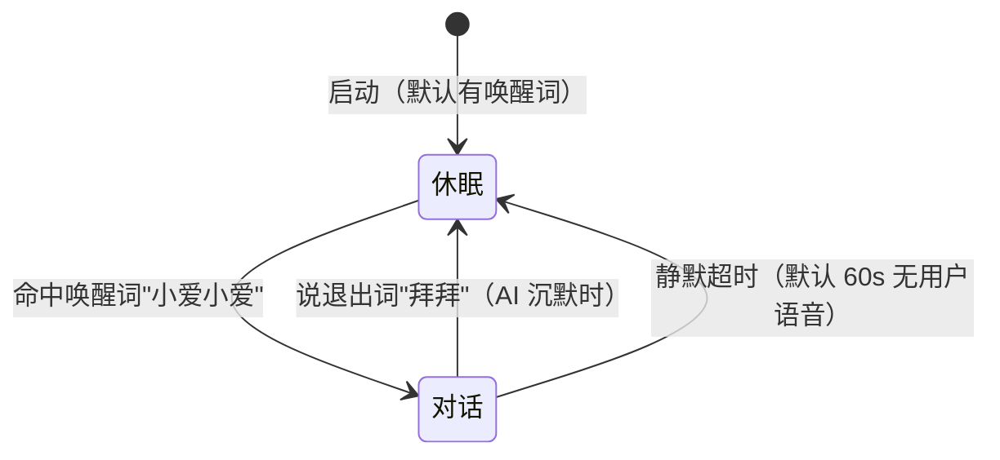

# 语音对话程序（voice_dialogue.py）—— 快速开始 + 参数 + 架构

麦克风 → voice1 ASR → DeepSeek LLM → voice0 TTS 的实时语音对话（单进程非阻塞编排）。
本文讲三件事：**怎么跑**、**每个参数是什么意思**、**背后怎么工作**（线程/时序）。
所有参数都可用 `python examples/voice_dialogue.py --help` 查看。

## 快速开始

**前提**：
- conda 环境 `voice-asr`（与 voice0 共享，Python 3.10 + torch + melo）。
- DeepSeek API key 写进 `dialogue/config.local.json`（已 gitignore，**绝不提交**），
  或设环境变量 `DEEPSEEK_API_KEY`。
- 中文输出必须加 `PYTHONIOENCODING=utf-8`（Windows GBK 终端会乱码/报错）。

**推荐启动**（GPU 机器）：

```bash
conda activate voice-asr
PYTHONIOENCODING=utf-8 python examples/voice_dialogue.py --asr-device cuda --tts-device cuda --vad-tail 300
```

- `--asr-device cuda`：ASR（paraformer）跑 GPU；无 GPU 换 `cpu`（实时性差些）。
- `--tts-device cuda`：TTS（melo）跑 GPU。
- `--vad-tail 300`：把静音判定从默认 600ms 降到 300ms，**每轮首包音频快 300ms**。
  代价是组织语言停顿 >300ms 时句子会被提前判定"说完"（残句）——残句由 post-commit
  barge 零延迟兜底：续句定稿在窗口内 → 撤答复合并重答；窗口外 → 变独立一轮（尾巴不丢）。
  你说话停顿多、很在意"不拆句"就调回 `--vad-tail 600`（默认）。
- 打断词默认「停下」，回声门控默认开（半双工）。
- 唤醒默认开（`--wake-word` 默认"小爱小爱"）：启动即休眠，说唤醒词才进对话，详见
  「休眠 / 唤醒 / 退出」。要恢复"启动即对话"旧行为：`--wake-word ""`。
  更多参数见下文「参数详解」。

## 架构：线程模型与时序

单进程、**全链路非阻塞**：主线程只负责采麦克风，识别 / LLM / TTS 各在独立线程干活。
主要线程：

| 线程 | 所在 | 职责 | 阻塞点 |
|---|---|---|---|
| 主线程（PortAudio 回调） | `voice_dialogue.py` | 采块 → AGC → 回声门控判断 → `asr.ingest` | `ingest` 队列满（maxsize=8）时背压 |
| ASR worker | voice1 `RealtimeASR` | 能量 VAD 断句 + paraformer 识别 → 回调 | 识别计算 |
| LLM 线程 | controller `_llm_loop` | 阻塞读 SSE → 按句切分 → `tts.submit` | `stream_chat`（网络读） |
| TTS worker | voice0 `RealtimeTTS` | queue 模式**串行**合成 + 播放 | 合成 / 播放 |
| `_tts_watch` 守护 | controller | 等最后 Job 播完 → `tts_busy` 回落（回声门控依据） | `job.wait()` |
| `_compress` 后台 | controller | 上下文超预算时一次性压缩旧历史 | LLM compress 调用 |

**时序图**（一条用户句子从麦克风到喇叭的完整旅程）：


**阻塞 vs 非阻塞**：
- **非阻塞**：`asr.ingest` 入队、启动 LLM 线程、`tts.submit` 入队、`feed_asr_sentence`
  （加锁 + 累加 + 起线程的快操作）。
- **阻塞**：`ingest` 队列满时背压（识别慢则主线程等）；`stream_chat` 读 SSE（LLM 线程
  专用）；TTS 合成/播放；`_tts_watch` 的 `job.wait()`。
- 主线程**永不碰网络/长任务**——所以你说完话，识别、LLM、TTS 在后台并行推进。

**核心心法一句话**（参数）：这些参数不是三个叠加的延迟。只有 `--vad-tail` 是"你停多久
算说完"（判断你说完了的固有成本），其余几个是在"本来就存在的时间里"捡机会，不额外加时。

---

## 自定义系统提示词

`--system-prompt 文件路径` 指定一个 UTF-8 文本文件作为系统提示词（角色设定/规则）。
系统提示词**永不压缩、永远放在消息最开头**：对话历史超出上下文阈值时，压缩只动历史，
生成的「此前对话摘要」拼接在系统提示词**之后**、历史之前——你的设定一条不丢。

## 会话历史存档（本地记录，默认开）

每 `--history-dump-interval` 秒（默认 **300**=5 分钟）把**完整对话状态**覆盖写到一个
本地 JSON 文件：系统提示词 + 压缩摘要 + 全部已 commit 轮次 + 正在进行未提交的内容。

- 文件：`--history-dump-dir`（默认 `sessions/`）下 `session_<启动时间戳>.json`——
  **每次启动程序新建一个文件**；退出时（Ctrl+C 等）再写一次。
- 后台线程写盘：`snapshot()` 在锁内只做浅拷贝（微秒级），磁盘 IO 在锁外——**不阻塞
  LLM 线程**的正常读流。
- 原子写（先写 `.tmp` 再改名）：中途崩溃/断电不会损坏已有存档。
- `--no-history-dump` 关闭；`--history-dump-interval 0` 只退出时写一次；
  `--history-dump-dir` 自定义目录（已 gitignore，对话内容不入库）。
- 存档 JSON 结构：`system_prompt`（系统提示词原文）`compressed_summary`（若已压缩）
  `history`（user/assistant 轮次数组）`user_turn_in_progress`（正在输入的话）
  `assistant_in_progress`（正在生成的回复）。

---

## 休眠 / 唤醒 / 退出（对话状态机）

默认**启动即休眠**（有唤醒词时）：mic 回调里两态状态机（`dialogue/wake.py` 的
`WakeSession`），休眠期只喂唤醒词 KWS（`--wake-word` 默认"小爱小爱"，逗号分隔多词），
**其余音频一律不喂 ASR**——说什么都不识别、不出字、不提交 LLM。命中唤醒词 → 进对话
（ACTIVE），播就绪语"在的，我在听"。



- **唤醒词、就绪语、告别语都不进对话历史/LLM**：唤醒词在休眠期没喂 ASR；就绪语/告别语走
  `tts.submit` 直连（不经 `DialogueController`），且 mic 回调把它们的播放 Job 当"自播回声"
  门控——自播期只喂打断词 KWS，不让"在的，我在听"被识别成你说的话再提交一轮。
- **退出词**（默认"拜拜"，逗号分隔多词）在 `on_sentence` 入口拦截：定稿句含退出词 → 控制台
  照常显示（识别事实）但不进历史/LLM，播"好的，我先退下啦，要和我说话，就唤醒我哦~"回休眠。
  仅 **AI 沉默时**可说——AI 播放期回声门控只喂"停下"，"拜拜"听不到。
- **静默超时**：对话期持续 `--inactive-timeout`（默认 60）秒无用户语音 → 播"一直不说话，
  我先退下啦，要和我说话，就唤醒我哦~"回休眠。"用户语音"信号 = ASR 出字（partial，任意
  距离都算）或 mic 块语音能量；AI 播放期不判超时（AI 在说 = 对话活跃）。`0`=关闭自动休眠。
- **对话历史跨休眠保留**：状态机不清 controller 历史，同一次程序运行内休眠不丢上文；只有
  程序重启才重建本地 session 存档。
- `--wake-word ""` 关闭状态机 → 启动即对话（旧行为：启动播"你好，我在听"）。唤醒词检测
  加载失败（如缺 pypinyin）时自动回退为启动即对话，不白屏。
- **已知边界**：就绪语播放的 ~1.5s 内（自播门控期）mic 只喂"停下"，此刻你开口会被忽略
  ——唤醒后稍等一下再说话；AI 回复播放期同理（半双工门控）。所以退出词只在 AI 沉默时可说。

### 离远说话也能提交：VAD 门槛 + MicAGC

原问题：离麦克风远说话，ASR 出 partial 但能量够不着 VAD 断句门槛（默认 -35dB）→ 永不
定稿 → 永不提交 LLM。**唤醒词检测跑在 MicAGC 增益后的音频上**（AGC 目标峰值 0.3、上限
8x、只放大不压缩）——唤醒词与远距离说话同灵敏度，不用凑近麦克风喊。

唤醒后离远说话仍可能只出 partial 不定稿：用 `--vad-threshold-db` 调低断句门槛。推荐启动
（GPU 机器，含远距离调参）：

```bash
conda activate voice-asr
PYTHONIOENCODING=utf-8 python examples/voice_dialogue.py --asr-device cuda --tts-device cuda --vad-tail 300 --vad-threshold-db -42
```

- `--vad-threshold-db -42`：门槛比默认 -35 低 7dB ≈ 约 2.2 倍距离余量；代价是环境噪声更易
  误断句（一句话在句中停顿处被拆开、提前发 LLM），由 post-commit barge 兜底合并。
- 按自己房间噪声校准：噪声大就调回 -38/-40；还够不着再降，并配合 `--echo-guard` 调大抓
  尾巴。

---

## 时间线全景（看懂这张图，参数就懂了一半）

你说："我每天晚上" ──停顿──> "下班回来就是刷视频"（完整一句话）

```
t+0       你说完"我每天晚上"
t+600ms   ── --vad-tail（默认600；快速开始推荐300→提前300ms）──> 连续静音 → 判定"说完" → 立即发给 LLM
t+600~1600   LLM 生成回复文字（~1s，与参数无关）
t+1600    回复文字提交给 TTS 合成 ─┐
t+1600~3100  合成中，喇叭没声      │ ← --post-commit-window 1.5s 就框在这段
          你在这空隙说"下班回来就是刷视频"
          → 取消这段还没播的音频、撤答复、整句重发 ✅   │
          （你没说话 → 什么都不发生，音频照常播）        │
t+3100    音频开始播放 ───────────┘
t+3100~4300  --echo-guard 1.2s：AI 开口后麦克风还听正常语音（抓你没收尾的尾巴）
t+4300+    只听"停下"（回声到了，防止 AI 回答自己的回声）
```

---

## 四个参数逐个讲

### `--vad-tail`（默认 600，快速开始推荐 300）—— 你停多久算"说完"

**直觉**：你停止说话后，要连续 N ms 静音，系统才判定"这句说完了"，才发给 LLM。

- 你停顿 < N ms 接着说 → 不拆句，话并在一起
- 你停顿 ≥ N ms → 判定说完，立即发
- 你停顿 1s+ 组织语言 → 被误判成"说完"→ 提前发 → 这就是"一句话没说完就被答"的来源

**推荐 300**：每轮首包音频快 300ms；停顿 >300ms 提前发的残句由 post-commit barge
零延迟兜底（续句窗口内合并重答 / 窗口外变独立一轮，尾巴不丢）。

**调大**（如 1000）：更稳不拆句，但每轮回复慢一点。**调小**（如 200）：更灵敏，但更容易
在你句中停顿处误判拆句。它管不了 1s+ 的组织语言停顿——那是下面两个参数的工作。

---

### `--post-commit-window 1500` —— AI 已答完但音频还没播时，你补话就重答

**直觉**：AI 的回复文字生成完 → 提交给 TTS 合成 → 合成要 ~1–1.5s 才出音频。这 1.5s 里
**喇叭完全没声**。这个窗口就是 `--post-commit-window`：

- 你在这个空隙里补话 → 取消这段还没播的音频、撤下刚才对残句的答复、整句+历史重发
- 你没说话 → 什么都不发生，音频按正常速度播

**它不增加任何延迟**——只是把"AI 答完但没开口"这个本来就存在的空档，用作合并机会。
你听到的控制台标记：`[合并] 撤回了刚才的答复，正在重答完整问题…`

**为什么是时间窗，不能精确到"音频开播那一瞬间"**：
先分清"内部知道"和"对外暴露"。voice0 **内部知道**开播时刻——播放线程每取一块、首次写
声卡前打点（`E:\temp\voice0\tts\core\engine.py` `_worker_play` 里 `_play_audio` 的首调用），
`--profile` 时还记进逐句 `play_start`。但**对外不暴露**：`Job`（`tts/core/jobs.py`）公开接口
只有 `done`（整个任务**播完**或被打断才置位）、`wait()`、`canceled`、`timing`（仅 profile
开时才有、是内部基准结构而非 API 契约），**没有"已开始播放"的事件信号**。所以"音频从喇叭
里出来"这个瞬间在现有接口下观测不到，只能拿"合成需要多久"（唯一可预测的量）去估算——
窗口设成 1.5s ≈ melo 首句合成延迟的上限。

**controller 怎么检测 done（不轮询）**：`_tts_watch` 守护线程**阻塞在 `job.wait()`** 上
（`threading.Event`，voice0 播完/被打断时调 `mark_done()` 置位才唤醒，永不悬挂），队列排空
后把 `_tts_busy` 回落、供回声门控。即 controller 能拿到的唯一实时状态是 `_tts_busy`
（True=提交后在播/待播，只在**排空**时回落 False）——它区分不了"还没开播"和"正在播"，
只有"播完了"这一个锤子。这正是 post-commit 只能做时间估算窗口、做不成精确信号的根因。
（理论替代：同进程轮询 `job.timing[0]["play_start"]`，但要永远开 `--profile` + 轮询循环 +
耦合 voice0 内部 schema；或给 `Job` 加 `.started` 事件——那是改 voice0，只读约束不允许。）

**为什么做成参数而不是写死**：合成速度因机器而异（CUDA 快、CPU 慢）。做成参数你才能按
自己机器校准。

**校准**：
- 窗口偏大（偶尔 AI 刚说半句就被切掉重答）→ 调小，贴近你的实际合成时间（CUDA 可试 900）
- 窗口偏小（尾巴常变成独立一轮、`[合并]` 不出现）→ 调大（如 2000）

---

### `--echo-guard 1200` —— AI 开口后，前 1.2s 麦克风还听你说话

**直觉**：AI 开始播放后，回声（喇叭声传回麦克风）要 ~1.2s 才到。所以前 1.2s 麦克风还
"开着"，能抓你**没说完的尾巴**（配合上面的重答）；过了 1.2s 回声来了，麦克风只认"停下"
（`ingest_kws_only`），防止 AI 自己回答自己的回声。

**它不影响回复快慢**，只控制"麦克风什么时候从'听你说话'切到'只听停下'"。

- 调大：尾巴更容易被抓住（尤其你说话慢/离得远），但回声暴露时间变长，自答风险略增
- 调小：更保守防回声，但尾巴更容易在定稿前被切掉

**为什么不能一直开着**：AI 一开口，回声就进了麦克风。若一直识别，AI 会把自己的回答
当成你说的话再回答——无限循环自答。这就是半双工门控存在的意义。

---

### `--merge-window 0` —— 关掉的旧方案（固定延迟）

**直觉**：如果在 `ASR 断句后强制等 N ms 再发 LLM`，这段等待里补话就能并进本轮——但代价是
**每一轮**都固定慢 N ms。你已否决这种每轮固定延迟，所以默认 0（关）。当前用上面的
post-commit barge 零延迟替代。留着它只是作为可选方案。

---

## 常见问题

**Q：我完整句"我每天晚上下班回来就是刷视频"，为什么拆成好几行显示？**
A：控制台按 ASR 断句显示多条 `[时间戳]` 行，这是识别层面的事实。关键是看是否只出现
**一次** `→ LLM 请求中…` + `[合并]` 行 + 一份完整答案——那说明整句合并送进 LLM 了。

**Q：尾巴显示 `… 刷视频` 但没后续？**
`… ` 前缀 = ASR 流式出字、未定稿、不会提交。尾巴被吞通常是：音频已开播 + 过了
`--echo-guard`，麦克风只认"停下"。把 `--echo-guard` 调大或尽早补话。

**Q：什么情况算"音频已开播"，续句算新轮？**
超过 `--post-commit-window`（即过了合成期、AI 真开口了）后的续句 = 新轮。这是半双工
门控的硬边界：AI 在说时你没法插话合并，只能等它说完说新的一句。

---

## 控制台诊断标记速查

| 标记 | 含义 |
|---|---|
| `… 文字` | ASR 流式出字，**未定稿**，不会提交 |
| `[a-bs] 文字` | 定稿句，已提交给 LLM |
| `→ LLM 请求中…` | LLM 请求已发出，等首个 token |
| `× LLM 出错` | LLM 流抛异常 |
| `[门控] AI 播放中…` | 回声门控开启：此刻说话只被当"停下"监听 |
| `[合并] 撤回了刚才的答复…` | post-commit barge 触发：补话被抓到，整句重答 |
| `休眠中，随时唤醒我哦~` | 启动即休眠（唤醒开），只说唤醒词才对话 |
| `[唤醒] 已唤醒，开始对话` | 命中唤醒词，进入对话 |
| `[休眠] 好的，我先退下啦…` | 退出词「拜拜」触发，告别语回休眠 |
| `[休眠] 一直不说话，我先退下啦…` | 静默超时触发，告别语回休眠 |
