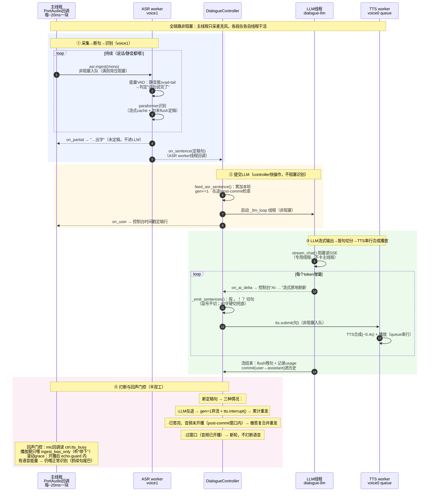
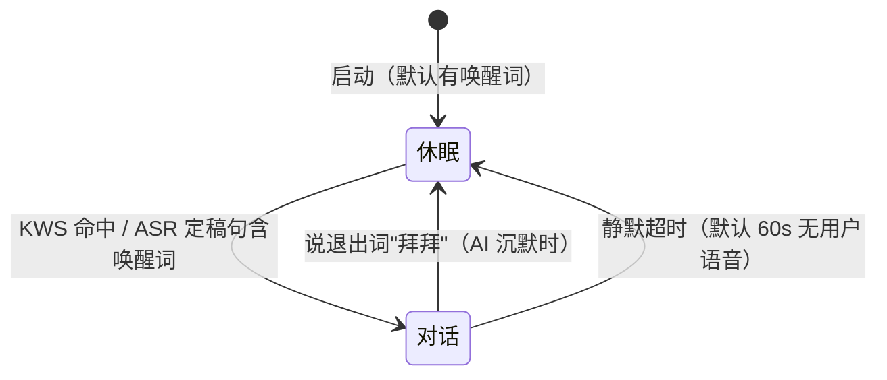

# 语音对话程序（voice_dialogue.py）—— 快速开始 + 参数 + 架构

麦克风 → voice1 ASR → LLM（在线 DeepSeek 或本地 llmx）→ voice0 TTS 的实时语音对话（单进程非阻塞编排）。
本文讲三件事：**怎么跑**、**每个参数是什么意思**、**背后怎么工作**（线程/时序）。
所有参数都可用 `python examples/voice_dialogue.py --help` 查看。

## 快速开始

**前提**：
- conda 环境 `voice-asr`（与 voice0 共享，Python 3.10 + torch + melo）。
- LLM 二选一，`dialogue/config.local.json`（已 gitignore，**绝不提交**）三字段决定引擎：
  - **在线 DeepSeek**（默认）——`api_key` 填真 key，或设环境变量 `DEEPSEEK_API_KEY` 兜底：

    ```json
    { "api_key": "sk-…", "base_url": "https://api.deepseek.com", "model": "deepseek-chat" }
    ```

  - **本地 llmx**（离线）——先起 llmx server（llmx 项目根下 `run_server.bat`，见 llmx `docs/usage.md`），
    `api_key` 仅需非空填 `"local"` 即可：

    ```json
    { "api_key": "local", "base_url": "http://127.0.0.1:8000/v1", "model": "Qwen3-4B-Q4_K_M" }
    ```

  - 更多引擎（通义/智谱/自写客户端等）见 `docs/EXTENDING-BACKENDS.md`。
  - 想换整份配置（多套服务商/测试配置）而**不动** `config.local.json`：`--llm-config <路径>`
    （默认 `dialogue/config.local.json`；`--llm-model/--base-url/--api-key` 仍可单独覆盖）。
- 中文输出必须加 `PYTHONIOENCODING=utf-8`（Windows GBK 终端会乱码/报错）。

## 一键启动脚本（start_dialogue.bat / start_dialogue.sh）

签名：`start_dialogue.bat [llm|agent] [vits|moss|melo] [额外参数...]`（sh 同理，`bash start_dialogue.sh [llm|agent] [vits|moss|melo] [额外参数...]`）。
`llm / agent / vits / moss / melo` 五个**快捷词任意顺序**，脚本逐个消费，遇到非快捷词即停止、其余原样透传；只传一个快捷词时其余用默认。

| 启动命令 | 效果 |
|---|---|
| `start_dialogue.bat` | **llm 大脑 + melo TTS**（默认，等同旧行为） |
| `start_dialogue.bat llm` | 显式 llm + melo |
| `start_dialogue.bat agent` | **agent 大脑**（本地 claude 常驻，`--brain agent`；`sessions/agent_session_id.txt` 有历史自动 `--agent-resume` 续会话，无则新建；不带 `--llm-config`） |
| `start_dialogue.bat vits` | llm + **vits 多音色**（默认音色 551 派蒙） |
| `start_dialogue.bat moss` | llm + **moss**（MOSS-TTS-Nano，CPU 实时+流式+零样本克隆，默认音色 Xiaoyu 中文女声） |
| `start_dialogue.bat melo` | 显式 melo（与默认相同，用于覆盖前面的 vits/moss） |
| `start_dialogue.bat agent vits` | agent + vits（`vits agent` 顺序任意等价） |
| `start_dialogue.bat vits --tts-voice-id 可莉` | vits + 指定音色（id 或名字） |
| `start_dialogue.bat moss --tts-voice-id clone:ref.wav` | moss + 指定音色（内置名或 clone:<wav>） |
| `start_dialogue.bat agent vits --vad-tail 600` | agent + vits + 透传任意 voice_dialogue 参数 |

> 透传参数走 argparse「后者覆盖」：`--tts-backend melo` 直接透传也能在最后覆盖前面的 vits 快捷词（同理 `--tts-voice-id`/`--vad-tail` 等）。

**默认参数（2026-09-14 起）**：一键启动固定带 `--agent-stream-tts --debug-tts`——
① agent 流式增量送 TTS（仅 agent 模式生效，LLM 模式被忽略，见下「agent 流式送 TTS」）；
② 会话调试日志落 `sessions/debug_tts_*.log`（排查"说了 X 就卡住/停下无效"靠它）。
两者都是 `store_true`，**无法在命令行取反**（无 `--no-X`）——要关就改脚本删
`DEFAULTS` 变量（bat：`start_dialogue.bat` 内 `set "DEFAULTS=..."`；sh：
`start_dialogue.sh` 内 `DEFAULTS="..."`）里的参数。直接跑 `voice_dialogue.py`（不经脚本）
仍默认关、零变化。

**推荐启动**（GPU 机器）：

```bash
conda activate voice-asr
PYTHONIOENCODING=utf-8 python examples/voice_dialogue.py --asr-device cuda --tts-device cuda --vad-tail 300 --system-prompt dialogue/user_prompt.txt
```

- `--asr-device cuda`：ASR（paraformer）跑 GPU；无 GPU 换 `cpu`（实时性差些）。
- `--tts-device cuda`：TTS 跑 GPU（默认 **melo**；换 vits/moss 加 `--tts-backend vits|moss`。
  moss 是 CPU 实时模型，GPU/CPU 均可）。
- `--vad-tail 300`：把静音判定从默认 600ms 降到 300ms，**每轮首包音频快 300ms**。
  代价是组织语言停顿 >300ms 时句子会被提前判定"说完"（残句）——残句由 post-commit
  barge 零延迟兜底：续句定稿在窗口内 → 撤答复合并重答；窗口外 → 变独立一轮（尾巴不丢）。
  你说话停顿多、很在意"不拆句"就调回 `--vad-tail 600`（默认）。
- `--system-prompt dialogue/user_prompt.txt`：指定系统提示词文件（角色设定）。这里用项目
  里的 `dialogue/user_prompt.txt`（已 gitignore，内容自己编辑）；不用可去掉该参数，详见
  「自定义系统提示词」。
- `--tts-normalize`：TTS 响度归一化（默认 None=原样播放）。`rms`=逐句静态 RMS 对齐
  -24dBFS（句间音量更一致）；`agc`=静态对齐+句内动态压缩+短停压缩（句首轻/句尾轻/
  中间响，推荐）。透传 voice0 `RealtimeTTS(normalize=…)`（voice0 只读，不改它）。
- `--tts-backend`：TTS 后端，默认 `melo`；`vits`=多音色（804 种），一键切用
  `start_dialogue.bat vits`（sh 同理），或直接 `--tts-backend vits`。vits 权重在
  `voice0/.cache/vits/`（属 voice0 项目，用 voice0 的 `preload_vits.py` 一次性下载；
  缺权重时 voice0 会报错并提示）。`moss`=MOSS-TTS-Nano（CPU 实时 + 原生流式 +
  零样本克隆，TTFA≈0.3s，加载 ~5s），一键切用 `start_dialogue.bat moss`，或直接
  `--tts-backend moss`；moss 权重在 `voice0/.cache/moss/`（voice0 的
  `preload_moss.py` 一次性下载；缺权重时 `--tts-list-voices` 或启动会提示）。
- `--tts-voice-id`：音色。vits=数字 speaker id（0~803，如 `103`=可莉）或名字（如
  `可莉`），默认 551 派蒙；moss=内置音色名（默认 Xiaoyu 中文女声，共 18 个，
  `--tts-list-voices` 看清单）或 `clone:<参考wav路径>` 零样本克隆（参考音频 3-10s
  最佳）；`melo` 后端下忽略。
- `--tts-list-voices`：打印 TTS 音色清单后退出（不启动对话）：vits=全部 804 个
  （`id: 名字`）；moss=18 个内置音色名（读 manifest，无需加载模型）。方便挑音色。
- 打断词默认「停下」，回声门控默认开（半双工）。
- 唤醒默认开（`--wake-word` 默认"小爱小爱"）：启动即休眠，说唤醒词才进对话，详见
  「休眠 / 唤醒 / 退出」。要恢复"启动即对话"旧行为：`--wake-word ""`。
  更多参数见下文「参数详解」。

## agent 大脑（--brain agent，可选项）

默认 `--brain llm` 用上面的 LLM 引擎（DeepSeek/llmx，**零改动**）。`--brain agent` 则把大脑
换成**本地 claude code**（`claude-agent-sdk` 常驻会话）：说话 → ASR → 提交给 agent →
取**最终结论** → TTS。中间的工具调用/思考文本默认不进 TTS（`--agent-stream-tts` 可让流式
增量也按句播报，见下）。设计文档 `docs/agent-integration.md`。

**用法**（无需配 LLM key；首次需联网装 SDK，运行期常驻零冷启动）：

```bash
PYTHONIOENCODING=utf-8 python examples/voice_dialogue.py --asr-device cuda --tts-device cuda --brain agent
```

- **人格** = `assistant/CLAUDE.md`（agent 工作目录默认 `repo 根/assistant/`，`--agent-dir` 可换）。
  它同时被显式读作 `system_prompt`（SDK 实测**不会**自动加载 cwd 的 CLAUDE.md）——改人格就改它。
  工程规范（根 CLAUDE.md）与对话人格互不干扰。
- **上下文在 claude 会话里**：自实现的**历史保存/会话压缩/系统提示词全旁路**，claude 自己管理
  并自动压缩历史。对话期间只允许这一个上下文，从启动到退出不换。
- **「停下」= ESC**：经 KWS 旁路命中 → `agent.abort()`（等价交互式 claude 按 ESC），
  立即中断当前回合、**进程/会话/历史全存活**，**绝不杀进程换上下文**；「停下」本身不进
  agent 上下文。打断后下一句全新 query。
  **abort() 直接 `_client.interrupt()` 不经 worker 队列（2026-09-14 实测）**：`_worker` 在
  `await self._inflight` 阻塞期间处理不了队列里的 ("abort",)——旧队列式 abort 会让在途
  query **跑满整轮才作废**（LLM 请求中喊"停下"不立即停 + 回复慢 20s，4× hard_stop 后
  query 仍跑到 217s 才 DISCARD）。直接 ESC 让 CLI 回合干净收尾，`_drain` 正常返回（无
  ResultMessage → 不回调），worker 随即处理下一 query。headless 验证
  `tmp/test_agent_abort_inflight.py`。
- **权限【询问】**：敏感操作（开灯/执行命令/写文件等）agent 会带 `【询问】` 标记先征求同意——
  标记照常播出去问（括号本身不念），你**口头回答后** agent 在同一上下文继续执行并汇报。
  v1 的权限边界 = `assistant/CLAUDE.md` 人格规则 + 权限模式/工具清单。
- **续上次会话** `--agent-resume`（对应 `claude -c`）：session_id 落盘在
  `sessions/agent_session_id.txt`（已 gitignore），重启带它续上次上下文；不带则新建会话
  （旧的仍在，随时可再续）。中途崩溃也可续（每次启动前落盘）。
- **权限模式** `--agent-permission-mode`（默认 `default`）：`bypassPermissions`=全放行（危险，
  别乱用）；预允许/拒绝的工具用 `allowed_tools`/`disallowed_tools` 或 assistant 目录配置控制。
- **agent 能力**：`assistant/.mcp.json` + `assistant/skills/`（骨架已建，按需填 MCP 服务/技能）。
- 本地会话存档（`sessions/*.json`）agent 模式**仍保留**（审计用，额外带 agent_session_id），
  与 claude 侧会话并存。
- 控制台同样有流式出字（agent 模式从 partial 增量走）与 `→ LLM 请求中…` / `× LLM 出错`
  状态行。
- **流式增量也送 TTS** `--agent-stream-tts`（默认关）：agent 只播最终结论意味着工具调用前
  的过渡句/思考段（实测「我把未来七天的天气捋一遍给你哈」）只显示不播、出声前干等工具
  7-8s；开此开关后 partial 也按句播报（心态标记跨 delta 未闭合不切句、句中心态标记也作
  切点、无标点缓冲以句末语气词兜底切），**最终结论到达三态收尾**：结论整段已进流式队列 →
  **不打断**自然播完（打断会把"已入队未开播"的结论音频全取消 → 完全静音，2026-09-13
  实测）；已播全是结论前缀 → 不打断只补送剩余；已播含过渡句/思考段 → 立即打断 + 从
  `_tail_overlap` 跳过已播开头重播（防"阿阳"整句播两遍）。**去重只对最后一个心态标记之后
  的结论本体算**——ResultMessage 全文常以过渡句开头，对全文算会把过渡句误当已播结论跳过
  打断。关=只播最终结论（旧行为零变化）。一键启动透传：
  `start_dialogue.bat agent --agent-stream-tts`。**仅在 agent 模式（`--brain agent`）生效**：
  `--brain llm` 下传它会被忽略（LLM 模式增量本就逐句送 TTS，无"过渡句"概念；2026-09-14
  曾因裸读该开关导致 LLM 模式 `on_ai_delta` 流式预览被跳过、控制台看不到心态标记，已修）。
- **结论重播回声自屏蔽** `--replay-echo-guard-ms`（默认 1500，仅 agent 结论含过渡句被切重播
  的那一支设置）：重播刚起瞬间新 ASR 定稿句大概率是"被切音频的回声"——过渡句被
  `tts.interrupt()` 切掉、尾音在房间里绕，回声门控的 grace 窗口又把回声喂进 ASR，VAD 闭成
  一条幻影句落在 post-commit 窗口内 → 把重播也打断（2026-09-14 实测「金价卡在'给你'、气泡
  冻在'最近两月…'」根因：GPU 上重播两句都在合成中，被打断后全部 stale 跳过 → 无音频 +
  SayTTS 链空退出、气泡冻住）。此窗口内新定稿句丢弃（只拦定稿句，partial/采集不受影响），
  窗口过后恢复正常。**与回声门控是两层不同窗口**：`--echo-guard` 拦"播放期间"的麦克风采集
  （只喂 KWS），本参数拦"重播刚起"已被 ASR 闭成定稿句的漏网回声。排查"重播被吞/气泡冻结"
  先看 `--replay-echo-guard-ms` 是否被意外调小，或 `VOICE1_DEBUG_TTS=1` 跑一遍看
  `FEED DROP(echo guard)`。
- **branch c 尾差打断 = 金价冻结真根因（2026-09-14，真实 debug 日志铁证
  `sessions/debug_tts_20260914_175020.log`，无 CLI 开关）**：`--agent-stream-tts` 下 agent
  流式吐完整结论 8 句（边吐边播，voice0 队列深：O1 刚开播、后面全在排队），最后一句
  "…不构成投资建议哦"按语气词"哦"切出、句末"。"留在流式缓冲没切出来。ResultMessage 到达
  （全文含尾"。"）→ `_tail_overlap(played, clean_full)` 返回 155/156（结论文本几乎全量已
  入队，只差尾"。"）→ 旧逻辑 `skip<len_clean` 落 **branch c** → `tts.interrupt()` 把**已入队
  未开播**的整条结论音频全取消，重播却只有 1 字"。"（`_find_cut` 吐不出 <2 字句、
  `_submit_tts` 丢纯标点）→ 重播为空 → **彻底静音（"说了阿阳就卡住"）**。`played` 累计的是
  **提交文本**、不是实际播放位置——队列深时它远超前于真实出声，branch c 据此打断就把正确
  音频打掉。修法（`controller._on_agent_result`）：**残尾 ≤ `_TRIVIAL_TAIL`（6 字）→ 视为
  已全量流式（branch a'）不打断**，让队列自然播完（残尾是纯标点/尾词，值不得打断；结论文本
  与流式一致时打断 = 白白杀掉已入队正确音频）。真正的 branch c（过渡句被结论打断+重播）不受
  影响——那是 `_tail_overlap` 返回小 skip 的场景。headless 验证 `tmp/probe_real_freeze.py`
  （interrupt=0、被杀音频=0、结论 8 句全进队）。排查"说了 X 就卡住"用 `--debug-tts`（或
  `VOICE1_DEBUG_TTS=1`；cmd 设不了环境变量所以给了命令行开关，定位后即删）看 `RESULT
  branch=/interrupt=` 行：`branch=c interrupt=True` 但 `remainder` 只有 1-2 字 = 尾差打断。
- **过渡句卡到结论才播 = 静默兜底切 + 换行对齐去重（2026-09-14 实测笑话场景，无 CLI 开关）**：
  `--agent-stream-tts` 下用户实测"好，讲个新笑话给你"**早打印到控制台、音频却等最终结论才
  播**（金价过渡句"我把近十年…覆盖）"无此问题）。两个叠加子问题：① **idle 切句缺失**——金价
  过渡句后跟 `\n`（`_find_cut` 边界）能立即切；笑话过渡句以"你"结尾（非句末语气词哈/哦/吧、
  无标点）**没有切点**，缓冲滞留整个工具调用期（实测 3.7s 干等，出声前工具都跑完了）。
  修法：`_agent_stream_thread` 把 `evt.wait()` 改 0.5s 分片睡循环，静默 ≥
  `_AGENT_IDLE_FLUSH_MS`（1.5s）且心态标记闭合 → 整段缓冲先送出声
  （`_idle_flush_agent_stream_locked`，过渡句计入 `_agent_tts_played` 供结论去重，不会播
  两遍）。② **`\n` 归一化**——流式切句在 `\n` **边界处切**（入队句子文本不含 `\n`），而
  `clean_full` 保留 `\n` → 两侧字符错位 → `_tail_overlap` skip=0 → 结论明明已全量流式进队，
  却误落 branch c 取消+整段重播。修法：`_on_agent_result` 比较/去重前 `replace("\n","")`
  （`\n` 对 TTS 发音无影响，仅对齐用）。headless 验证 `tmp/probe_joke_transition.py`
  （修后 submits=6、interrupts=0、canceled=0：过渡句 1.5s 内出声、结论 5 句自然播完）。
  排查"过渡句打印了但不播"用 `--debug-tts` 看 `FLUSH idle`（静默兜底切已生效）与 `RESULT
  branch=a`（换行对齐后结论全量覆盖，不打断）。
- **结论全量流式仍整段重播 = LCS 占比判全覆盖（2026-09-14 鬼故事实测「好啊阿阳说两遍」）**：
  ResultMessage 全文含过渡句前缀（agent 只在开头带一次心态标记 → `concl_start` 掐不到过渡句），
  而过渡句+整篇都已在 played **开头**——`_tail_overlap` 只比 played **尾部**（重叠在 played
  开头就匹配不上）→ skip=0 → branch c interrupt + 整段重播"好啊阿阳"两遍（日志
  `sessions/debug_tts_20260914_201640.log` RESULT ctx=14 skip=0 branch=c，随后重播行重发同句）。
  修法（`controller._on_agent_result`）：新增 `_overlap_ratio(a,b)`（**最长公共子序列占比**，
  一维滚动 DP，O(n·m) 每回合一次可忽略）——内容保序、**容忍流式切句/丢标点的中段错位**（同一
  份文本中段 particle 切句吞句号、`。」` 独立段被丢，played 与 clean_full 错位仍 ~0.7）。
  ≥0.6 → 视为已全量播过，`skip=len(clean)` 落 branch a' 不打断不重播；<0.6 才
  `max(_tail_overlap, _lcp)` 求补送起点（只流式了结论开头一点 = 真没播完要补送）。**`_tail_overlap`
  只查 played 尾部是旧设计盲区：全量流式时重叠在 played 开头，必须补查 LCP/LCS 这类"前缀/任意
  位置"判据。** headless 验证 `tmp/probe_ghost_overlap.py`（interrupts=0、"好啊阿阳"只 submit
  一次、连续标点已塌缩）。排查"同一句话播两遍"用 `--debug-tts` 看 `RESULT branch=/interrupt=`：
  `branch=c interrupt=True` 但 `played` 与 `clean_full` 内容几乎相同（LCS 高）= 全量流式误重播。
- **连续相同标点禁止送 TTS（2026-09-14 用户实测鬼故事"过去……"合成怪声）**：`_clean_for_tts`
  里 `_PUNCT_RUN_RE` `([。！？…～、；：，,—])\1+` → 单字符，把连续相同标点（`……`、`。。`、
  `——` 等）塌缩——TTS 念重复标点不稳、无朗读意义。**只影响送 TTS 的文本，控制台/历史/存档
  保留原文**（显示仍是 `过去……`，朗读是 `过去…`）。排查"TTS 怪声"先看送 TTS 文本有没有连续
  标点；写新"送 TTS"路径记得过 `_clean_for_tts`（心态剥除/括号/连续标点一次到位）。
- **AI 自播期 KWS「停下」自屏蔽 —— 已停用（2026-09-14 用户实测回归推翻）**：原设计（防御
  性）——回声门控播放期把 mic 喂给「停下」KWS（`ingest_kws_only`），怀疑 **AI 自己的音频会
  被 KWS 自触发**，故 `kws_guard_active()`（`_replay_kws_until` 截止）让 `_on_interrupt` 在
  窗口内跳过 `hard_stop`；agent-stream 模式每次提交 TTS 按估算播放时长
  （`max(replay_echo_guard, len/5+3s)`）顺延守卫，结论收尾再按整段结论时长顺延，覆盖流式/
  自然播放/重播全程。**实测推翻**（`sessions/debug_tts_20260914_222157.log`）：金价/鬼故事
  播放期的守卫命中（6~7 次）**全是用户在重复说"停下"被吞**（间隔 2.5~12s，金价文本无
  tíng xià 匹配音）——"播放期只听'停下'"的契约被打破（用户实测"说了好多次都没反应"）；
  AI 音频自触发"停下"在**所有真实日志零实例**（金价冻结真根因是 branch c 尾差打断，见上）。
  KWS 无法从声学区分"AI 回声"与"真·停下"。**停用 = 删 `_submit_tts` / covered / branch c 三处
  `_replay_kws_until` 设定点，`kws_guard_active()` 恒 False**——真"停下"随时生效（流式/自然
  播放/重播全程可打断）。若将来 AI 音频真自触发，**正解是 AEC 回声消除**（从 mic 信号减喇叭
  参考），不是宽守卫。headless 验证 `tmp/probe_kws_stop_playback.py`（播放期"停下"→
  hard_stop：gen+1、interrupt 杀在播音频、agent abort、问题保留历史）。

## assistant/ 目录（agent 大脑工作区，独立 git 子模块）

`--brain agent` 时 claude 会话的工作目录默认是 `repo 根/assistant/`（`--agent-dir` 可换），
对话人格与 agent 能力都装在这里。**它被管理为独立的 git 子模块**（GitHub 私有仓库），与
voice1 主仓库解耦：改人格 / 加技能只动子模块，不污染主仓库历史；子模块可单独 clone、
单独版本化。

**设计目标**

- **人格与工程规范分离**：`assistant/CLAUDE.md` = 对话人格（连接时显式读作 `system_prompt`，
  SDK 不会自动加载 cwd 的 CLAUDE.md），与根 `CLAUDE.md`（工程规范）互不干扰。改人格只改
  子模块里这一个文件。
- **能力自包含、随目录走**：`assistant/.claude/skills/`（claude 标准技能发现位置）+
  `assistant/.mcp.json`（MCP 服务）定义 agent 的全部工具能力，不依赖主仓库任何东西。
- **权限边界统一**：人格规则（【询问】先征求同意）+ 权限模式 / 工具白名单
  （`dialogue/agent.py` 的 `_DEFAULT_ALLOWED_TOOLS`）共同决定 agent 可直接做什么、要问什么。
- **可移植、凭据不落地远端**：入库的是模板 + 脚本 + 文档，新机器 clone 后
  `git submodule update --init` 拉子模块、补一份本地凭据即可用；真实凭据（和风 API Key /
  JWT 私钥）由子模块自身 `.gitignore` 排除，**绝不进仓库**（见下）。

**基本目录结构**

```
assistant/                     # agent 工作目录 = 独立 git 子模块（GitHub 私有仓库）
├── CLAUDE.md                  对话人格（连接时显式读作 system_prompt）
├── .mcp.json                  MCP 服务配置（外部工具，空骨架）
├── .gitignore                 子模块忽略规则（凭据 / 缓存不入库）
├── .claude/
│   ├── settings.local.json    Claude Code 本地配置（机器相关）
│   └── skills/
│       └── qweather/          和风天气技能（脚本 + 模板 + 本地数据）
│           ├── SKILL.md       技能说明（含数据新鲜度硬规则）
│           ├── fetch.sh / fetch.bat   一键拉取 + AI 摘要（force / 30 分钟新鲜度自判）
│           ├── scripts/       weather.py / weather_to_ai_summary.py / check_fresh.py / get_location.py
│           ├── config.json.template / ed25519-*.template   空模板（可入库、可分享）
│           ├── config.json / ed25519-private.pem   和风凭据（**不入库**）
│           └── weather_data.json / weather_summary.md   数据产物（可再生）
└── skills/
    └── README.md              技能总览：发现位置 / 白名单 / 根因（说明文档，技能实体在 .claude/）
```

> **子模块凭据规则**：`config.json`（和风 API Key / JWT）、`ed25519-private.pem`（私钥）与
> `ed25519-public.pem`（公钥，和私钥成对）都是本地持有，**绝不提交、绝不外传**——哪怕私有
> 仓库也不入库（历史删不掉、误改公开即一键泄露）。可入库/可分享的只有 `*.template` 空模板。

## 架构：线程模型与时序

单进程、**全链路非阻塞**：主线程只负责采麦克风，识别 / LLM / TTS 各在独立线程干活。
主要线程：

| 线程 | 所在 | 职责 | 阻塞点 |
|---|---|---|---|
| 主线程（PortAudio 回调） | `voice_dialogue.py` | 采块 → AGC → 回声门控判断 → `asr.ingest` | `ingest` 队列满（maxsize=8）时背压 |
| ASR worker | voice1 `RealtimeASR` | 能量 VAD 断句 + paraformer 识别 → 回调 | 识别计算 |
| LLM 线程 | controller `_llm_loop` | 阻塞读 SSE → 按句切分 → `tts.submit` | `stream_chat`（网络读） |
| TTS worker | voice0 `RealtimeTTS` | queue 模式**串行**合成 + 播放 | 合成 / 播放 |
| `_tts_watch` 守护 | controller | 等最后 Job 播完 → `tts_busy` 回落（回声门控依据） | `job.wait()` |
| `_compress` 后台 | controller | 上下文超预算时一次性压缩旧历史 | LLM compress 调用 |

**时序图**（一条用户句子从麦克风到喇叭的完整旅程）：



**阻塞 vs 非阻塞**：
- **非阻塞**：`asr.ingest` 入队、启动 LLM 线程、`tts.submit` 入队、`feed_asr_sentence`
  （加锁 + 累加 + 起线程的快操作）。
- **阻塞**：`ingest` 队列满时背压（识别慢则主线程等）；`stream_chat` 读 SSE（LLM 线程
  专用）；TTS 合成/播放；`_tts_watch` 的 `job.wait()`。
- 主线程**永不碰网络/长任务**——所以你说完话，识别、LLM、TTS 在后台并行推进。

**核心心法一句话**（参数）：这些参数不是三个叠加的延迟。只有 `--vad-tail` 是"你停多久
算说完"（判断你说完了的固有成本），其余几个是在"本来就存在的时间里"捡机会，不额外加时。

---

## 自定义系统提示词

`--system-prompt 文件路径` 指定一个 UTF-8 文本文件作为系统提示词（角色设定/规则）。
系统提示词**永不压缩、永远放在消息最开头**：对话历史超出上下文阈值时，压缩只动历史，
生成的「此前对话摘要」拼接在系统提示词**之后**、历史之前——你的设定一条不丢。

## 心态标记（LLM 回复表情，默认开）

让 LLM 在**每轮回复开头**带一个 `【心态：xxx】` 表情标记（在 `user_prompt.txt` 里约定，
例如「【心态：开心】宝宝想你了」）。它是模型的真实输出，所以**正文、对话历史、本地存档、
控制台全部保留**，只在送 TTS 那一刻被剥掉——**不会被念出来**。

- **预设心态表**（16 个，提示词要求 LLM 必须且只能从里面选一个）：平和、开心、兴奋、惊喜、
  温柔、关切、好奇、期待、无奈、失望、沮丧、难过、担心、不满、生气、愤怒。
  没有特别情绪选"平和"；造词超纲 → 兜底「平和」。
- **兼容两种括号**：`【心态：开心】` 与 `[心态:开心]` 都识别。
- **开关**：`--mood-marker`（默认开）/ `--no-mood-marker`（关）。关闭后 controller 的心态
  逻辑（剥标记 / 解析 / 默认心态）全部跳过，**运行行为与未加此功能时完全一致**——此时若
  `user_prompt.txt` 仍要求吐标记，会被 TTS 原样念出来。开关只管代码；是否让 LLM 吐标记由
  `user_prompt.txt` 决定，两者配套使用：想彻底回到原来 = `--no-mood-marker` + 把
  user_prompt.txt 里的心态约定删掉。
- **扩展点**：controller 提供 `register_callbacks(on_mood=...)` 与 `ctrl.mood`（当前心态，
  LLM 没带标记时为「平和」），供上层做表情显示 / 驱动 TTS 情绪等。

## live2d 桌宠联动（心态→表情 + 对话文本→说话框，默认关）

把 voice1 的输出实时驱动到 live2d 桌宠（`desktop_pet.py`）——**两个通道**：
① LLM 每轮回复带的【心态：xxx】切角色表情（**随句子播放发射**——心态标记**文本到达即发**
  会全部挤在 LLM 流结束的 ~1s 里、音频播几十秒时表情卡最后一个；改由 SayTTS 播放链在
  "携带该标签的句子实际开播"瞬间切（说话框同款 job.done 时序：前句播完≈下句开播），
  表情跟听感同步；一条回复多次切换心态跟随，2026-09-19）。**句中心态不丢**：`_find_cut`
  按标签**前**切（标签领衔下一句，`_submit_tts` 提交前 `_leading_mood` 取句首首个心态）——
  旧按闭合处切会把句中标签粘前句尾巴、`_leading_mood` 只读首个 → "…我懂【心态：温柔】但
  你别硬加…"的温柔随前句 submit 丢失；② **所有送进 TTS 的
文本**显示到角色头顶的说话框（像旁白跟读，音频一响字就冒出来）。

- **怎么开**：桌宠先跑 `python desktop_pet.py --emotion 平和 --listen --control-port 5000`
  （`--listen` 让嘴随系统播放音频对口型）；voice1 再加 `--live2d-port 5000`。
- **启用三级门槛**（缺一不启用）：心态标记开（`--no-mood-marker` 则心态无从解析）→ 给了
  `--live2d-port` → **启动时 TCP 测活成功**。不给端口 = 不启用，行为与未加此功能完全一致。
- **说话框覆盖全部 TTS 文本**：不只是 LLM 对话回复句（剥掉心态标记后的正文），**就绪语
  （"在的，我在听"）、告别语、启动问候（"你好，我在听。"）**都算——凡是 `tts.submit` 的
  文本就上说话框。实现上把 `tts` 包了一层 `SayTTS`（`dialogue/say_tts.py`），controller
  零改动，文本来源一个不落。
- **逐句链式跟播（不抢发）**：voice0 `mode="queue"` 提交即入队、串行播放——LLM 一口气吐
  3 句时 3 个 Job 瞬间入队、音频却还在播第 1 句。若在 submit 那一刻就发文本，气泡会被
  最后一句立刻刷新（音频没跟上）。故 `SayTTS` 做逐句链：**第 1 句文本提交即发，之后每句
  都等前一句播完（`job.done`）才发**——queue 模式下 prev-done ≈ 下句开播，气泡永远显示
  "正在播的那句"、随音频逐句推进。被打断（`hard_stop`）→ 作废句文本丢弃不播。
- **复位消息 = 一条组合**：`{"emotion":null,"say":null}` 同时恢复默认表情平和 + 隐藏说话框
  （live2d 协议：给值=设置、`null`=清除；气泡是"粘性"的，不显式清就一直挂着）。
- **复位点**（都发这条组合消息）：① 初始化测活成功时（清掉桌宠上次遗留的表情/气泡）；
  ② **拜拜 / "停下"打断 / 静默超时回休眠**时（无条件收框 + 表情归位）；③ **Ctrl+C 退出**
  时（桌宠常驻，voice1 退后角色回平和待机、气泡收掉）；④ **一轮播放真正播完**（受下面
  `--live2d-idle-reset` 开关控制，默认开）。
- **一轮播完自动复位 `--live2d-idle-reset`**（默认开）：这轮对话的音频全部播完、气泡不再
  需要时，自动收框 + 表情回平和——下一轮说话会重新冒框、按新心态切表情。`--no-live2d-idle-reset`
  关闭后，气泡/表情会保持到下一轮或拜拜/超时/停下才清。判定"真正播完"用 controller 新加的
  `turn_active`（LLM 流在途 **或** TTS 队列非空）：LLM 句中停顿、句与句之间的空隙队列也会
  短暂排空，但流还在途就不算播完——避免气泡在一句长回复中途被收掉、表情提前归位。
- **测活失败**：打印一条 `[live2d] 表情联动关闭…请确认已先启动 desktop_pet.py` 告知用户，
  **彻底禁用、不重试**——对话一切照常，只是不联动桌宠。
- **运行中 live2d 中途退出**：**继续如常发送**，每次失败打印"live2d server 连接失败，请
  检查"提醒——**惰性重连**：连接断了下次发送自动重建（桌宠可能重启回来，不做自动停用、
  不做主动探测/心跳）。
- **协议**：原始 TCP `127.0.0.1:PORT`，一行一个 JSON、UTF-8 + `ensure_ascii=False` + `\n`
  结尾，无响应。**常驻长连接 + 惰性重连**（用户拍板）：worker 持一条 socket 串行发送，
  发送前不检查状态，`sendall` 抛 `OSError` 即关旧重建重发一次——断线后第一条消息可能丢
  （TCP 缓冲"假成功"），第二条必触发重建送达。长连接也让桌面端 `client_count` 恒为 1，
  "有 AI 在驱动"的判定（desktop_pet `--look-at-cursor` 的"有事"）才真正成立。voice1 的
  16 心态名与 live2d `EMOTIONS` 键**完全一致**，恒等映射，无需转换表。通道可合并在一条
  消息里，voice1 目前逐条发（emotion / say / reset 各自独立成行）。
- **只发 emotion/say 不碰 mouth**：说话期嘴的自动开合由 live2d 自己的 `--listen`（WASAPI
  回环对口型）负责——voice1 若发 `{"mouth":…}` 反会被桌宠音频能量线程覆盖，故不接管。
- **实现**：`dialogue/live2d.py` 的 `Live2dEmitter`——构造**同步测活**（连上即补发一条
  组合复位，失败禁用）；`emit(mood)`/`say(text)`/`reset()` 触发点只在锁内入队（微秒级，
  **不阻塞 LLM 线程**）；实际发送在常驻 daemon worker（FIFO 串行保序），worker 持一条
  **长连接** socket（`_lock` 保护，与 `close()` 并发安全），发送失败**惰性重建重发一次**。
  回休眠复位挂 `wake.go_sleep()` 的 `on_sleep` 回调（bye / 静默超时两条回休眠路径的
  **唯一汇聚点**，见 `dialogue/wake.py`）；"停下"挂在 `asr.on_interrupt` 的组合回调
  （`ctrl.hard_stop()` + `live2d.reset()`）。
- **headless 测试**：`tests/test_live2d.py`——假 TCP server 断言送达（emotion/say/reset
  保序）、测活失败禁用、复位归位、bye/timeout 联动、**惰性重连**（断连接后下次发送自动
  重建送达）；`tests/test_say_tts.py`——假 TTS/Job 断言逐句链式不抢发、打断丢作废句、跨句
  停顿不复位（跑法 `PYTHONIOENCODING=utf-8 …/python.exe tests/test_live2d.py`，
  `test_say_tts.py` 同理）。

## 文本输入源（键盘/脚本输入，调试用，默认关）

不方便对麦克风说话时，用**文本**输入代替语音调试对话系统——**只加一个输入源，输出侧零改动**
（控制台 / 音频 / live2d 说话框+表情全部走原逻辑）。不起脚本时原程序**完全不变**。

- **怎么开**：主程序加 `--text-input-port <端口>`（默认关）起本地 TCP 监听；另开终端跑
  `python examples/text_input.py [端口]`（默认 9123），`while input()` 每行发一条文本。
- **与语音并存**：麦克风照常说、脚本照常敲，两路输入都有效；文本走独立 TCP 线程，天然绕开
  回声门控 / 自播门控 / 休眠 KWS 分派这些 mic 采集层的拦截（`examples/voice_dialogue.py`
  `cb()` 里）。
- **文本模式语义**（与语音输入的区别，用户拍板）：
  - **唤醒词 / 退出词无效**——输入"小爱小爱"、"拜拜"都当**普通句子送 LLM/agent**，不触发
    唤醒/退出状态机；
  - **休眠态自动唤醒直接对话**——休眠中直接输入问题即对话，**不播就绪语**；
  - **打断词整行完全等于才生效**（如输入行就是"停下"）→ 立即停当前 LLM+TTS 输出，该行
    **不进历史/不送 LLM**；无输出在途 = 什么也不做；**live2d 同步复位**（收说话框 + 表情
    回平和，与语音 KWS 打断 `_on_interrupt` 一致——否则气泡卡在"正在播那句"）；
  - 其余任意行 → 当一条"完整定稿句"提交（**非阻塞**：发一句可立即敲下一句），正在输出时敲
    下一句立即打断重发（同语音 barge-in）。**打断语义比语音更强**（`barge_audio=True`）：
    **只要 TTS 还在播就立即切掉在播音频**——哪怕 LLM 已答完、仅剩音频在播也打断
    （用户实测"播放笑话时输入下一问，旧音频还在播"定位出的差别）；语音定稿句默认**不**打断
    已答完的音频（让回答播完、新回复排队）——两条输入源语义不同。
- **实现**：注入点复用 `ctrl.feed_asr_sentence(SentenceResult(...), barge_audio=True)`——与
  麦克风定稿句同构，barge-in / post-commit / 历史 / 存档 / live2d 输出全部自动继承，输出链
  零改动。`barge_audio` 是 `feed_asr_sentence` 的新参数（默认 False 保持语音旧行为）：
  `in_flight or post_commit or (barge_audio and _tts_busy)` 任一成立才 `tts.interrupt()`。
  模块 `dialogue/text_input.py`（`TextInputServer` TCP server + `route_text_line` 纯路由，
  headless 可测）；客户端 `examples/text_input.py`。
- **headless 测试**：`tmp/test_text_input.py`（gitignored）——`route_text_line` 路由纯逻辑
  + `TextInputServer` TCP 集成（多客户端连/断）。

## LLM 模式工具调用（`--tools`，默认关，仅 `--brain llm` 生效）

给 **DeepSeek 直连的 LLM 模式**补上工具调用能力，同时**保住它 0.5s 首 token 的速度**——
不做 agent 编排，参照 Alife 用 **XML 内联工具调用**。完整设计见 `docs/llm-tools.md`。

- **怎么开**：`--brain llm --tools all`（或 `--tools get_time,get_weather,get_gold_history,get_soviet_joke` 按名加载；
  `--tools mcp` = 只加载 MCP 工具，见下「MCP 桥接」）。
  **默认关**：不传 `--tools` = 不注入提示、不挂解析器、`_llm_loop` 走单轮原路径，**旧行为
  零变化**。`--brain agent` 下忽略并打印提示（agent 走 claude 原生工具/MCP，两套不混用）。
- **工作原理**：系统提示词注入工具文档 → 模型在**输出文本流里直接写自闭合 XML 标签**
  （`好的我来查一下<get_weather city="北京"/>`）→ `dialogue/toolparse.py` 字符级流式解析
  （标签一闭合立即执行本地工具）→ 结果回灌成 `[工具结果]` user 消息 → **第二轮流式**出最终
  答案。两轮感知代价≈0：每轮都是 0.5s 首 token 的纯流式，且第 1 轮**过渡句已送 TTS 出声**
  （工具执行期用户听到"好的我来查一下"，等待被说话掩盖）。
- **追问会自动重查**（2026-09-16 实测补）：提示词明确"每轮都可调用、随时可再次调用"——
  用户追问新日期/新城市等旧结果没覆盖的信息时模型会**重新调用**工具，而不是用旧结果硬答或
  说"没有数据"。`get_weather` 默认取整周 7 天，头一次查天气就把整周拿到手（用户追问后天/
  大后天不用重查就能答）。
- **工具包在仓库根 `tool/`**（独立顶层包）：`tool/base.py`（`Tool` / `@tool` 装饰器 / 执行
  超时守卫 + 结果截断）、`tool/__init__.py`（`pkgutil` 自动扫描包内模块，**新增工具 = 丢一个
  py 文件零改码**）、`tool/time_tool.py`（`get_time` 零网络）、`tool/weather.py`
  （`get_weather` 复用 assistant/qweather 技能直接 HTTP 调，不走 MCP 更轻）、`tool/gold.py`
  （`get_gold_history` 复用 assistant/gold 数据管线直接 HTTP 调，不走 MCP 更轻；国内沪金 AU0
  全历史统计 + 国际现货金实时，含免责声明）、`tool/soviet_joke.py`（`get_soviet_joke` 复用
  assistant 的 soviet-joke skill 语料读 corpus.md 挑一条，不走 MCP；镜像 tell.py 格式不变量，
  参数 theme 按主题挑 / avoid 避让已讲过的标题防"再来一个"重复）。
- **MCP 桥接（2026-09-21）**：llm+tools 也能接 MCP server——`tool/mcp.local.json`（**gitignored**，
  含机器路径/凭据；示例 `tool/mcp.local.example.json` 入库可抄）配 `command`（stdio 子进程）或
  `url`（streamable HTTP），桥接层把 MCP 工具转成本方案 `Tool`，**暴露名 `server_工具名`**（如
  `author_info_get_author_info`），模型照常写 XML 标签调用。业务 MCP 脚本惯例放 `tool/mcp_tools/`。
  `--tools mcp` = 只 MCP、`--tools all`/不传 = 本地 + MCP 全上（无 mcp.local.json 时干净跳过）、
  `--tools get_time,mcp` = 混合。支持 `.mcp.json` 风格字段（`disabled` 跳过 / `timeout` 作工具
  超时 / `env` 透传），`command: python` 自动换 `sys.executable`、相对路径按仓库根转绝对。
  完整设计见 `docs/llm-tools.md` §5.8。
- **参数**：
  - `--tools-max-rounds <n>`（默认 3）：工具续轮上限，防无限循环。
  - `--tools-timeout <秒>`：覆盖单工具默认执行超时（不传用自带，如 get_time=3s /
    get_weather=15s；MCP 工具超时取 `tool/mcp.local.json` 里对应 server 的 `timeout`，缺省 60s）。
- **安全阀**：工具执行在独立线程 + 超时守卫（防挂死拖住 LLM 流）；异常/超时/未知工具都回灌
  `[工具错误: …]` 让模型优雅回应；结果按 `max_result` 截断防爆上下文。
- **网络代理**（2026-09-18）：代码**不写死代理地址**；`load_tools()` 时未显式配
  `HTTP_PROXY`/`HTTPS_PROXY` → 自动 `NO_PROXY=*` 绕过 Windows 系统代理直连（金价/天气国内源
  可达，Clash 没开也能查）；显式配了代理环境变量则尊重。
- **结果权威、一次说清**（2026-09-16 实测补）：`[工具结果]` 注入消息与 system 都声明结果数据
  是**权威事实**、直接据此回答**一次**，不要重复/复述、不要编造数据里没有的数字——曾实测
  DeepSeek 在**单次输出**里把同一问题答了两遍且自相矛盾（一次 30/23 有小雨、一次 30/22
  不下雨）。**`present` 例外**（2026-09-19）：带 `present` 的工具（`get_soviet_joke`）结果是
  **用户要听的内容本身**，注入消息改带该工具呈现要求（完整逐字讲）并覆盖「不要重复」——
  实测 DeepSeek 把笑话压成一句评论，用户要的是原文完整讲。
- **控制台诊断**：工具执行完成打独立状态行
  `[工具] name 参数 耗时 X.XXs`（`on_tool` 回调）——参数（`city="北京"`，无参数显示
  「（无参数）」）+ 耗时 + 结果预览（限 120 字、截断加省略号），不占 AI 定稿行。
- **与打断/存档/live2d 的关系**：续轮在 `_llm_loop` 内同一个 gen、同一条流线程——barge-in /
  post-commit / 回声门控把"问题→工具→答案"整轮看作一轮，打断时在途工具续轮一并作废；
  工具结果进 `_history`（`[工具结果]` user 消息），存档/压缩正常包含；心态标记/live2d 不动。
- **headless 测试**：`tmp/test_llm_tools.py`（gitignored）——XML 解析器单元（跨 delta 拆分 /
  成对标签 / 透明容器 / 实体 / 注释）/ 假 LLM 两轮流（过渡句先出声、历史顺序）/ 安全阀
  （轮数上限 / 超时 / 异常 / 未知工具）/ 默认关零变化；`tmp/test_mcp_tools.py`——真实
  MCPServer（mcp SDK 2.x）stdio + streamable HTTP 端到端（枚举 / 参数转换 / 调用 / disabled
  跳过 / close 清空 / load_tools 的 mcp token 展开）。

## 会话历史存档（本地记录，默认开）

> **仅 LLM 模式**：`--brain agent` 时不写本地存档——历史/压缩在 claude 会话里由 claude 自己
> 管理（重启用 `--agent-resume` 续），只落 `sessions/agent_session_id.txt`。

每 `--history-dump-interval` 秒（默认 **300**=5 分钟）把**完整对话状态**覆盖写到一个
本地 JSON 文件：系统提示词 + 压缩摘要 + 全部已 commit 轮次 + 正在进行未提交的内容。

- 文件：`--history-dump-dir`（默认 `sessions/`）下 `session_<启动时间戳>.json`——
  **每次启动程序新建一个文件**；退出时（Ctrl+C 等）再写一次。
- 后台线程写盘：`snapshot()` 在锁内只做浅拷贝（微秒级），磁盘 IO 在锁外——**不阻塞
  LLM 线程**的正常读流。
- 原子写（先写 `.tmp` 再改名）：中途崩溃/断电不会损坏已有存档。
- `--no-history-dump` 关闭；`--history-dump-interval 0` 只退出时写一次；
  `--history-dump-dir` 自定义目录（已 gitignore，对话内容不入库）。
- 存档 JSON 结构：`system_prompt`（系统提示词原文）`compressed_summary`（若已压缩）
  `history`（user/assistant 轮次数组）`user_turn_in_progress`（正在输入的话）
  `assistant_in_progress`（正在生成的回复）。

---

## 休眠 / 唤醒 / 退出（对话状态机）

默认**启动即休眠**（有唤醒词时）：mic 回调里两态状态机（`dialogue/wake.py` 的
`WakeSession`），休眠期**双路唤醒**（`--wake-word` 默认"小爱小爱"，逗号分隔多词）：

- **近场低延迟：唤醒词 KWS**（sherpa 3.3M）逐块 `feed()`，命中即唤醒（~0.2-0.4s）。
- **远场兜底：睡眠态也喂 ASR 流式**——`on_sentence` 定稿句含唤醒词 → 唤醒。根因
  （2026-09-12 实测）：KWS 灵敏度比 paraformer-large 低 ~10dB，40cm 说话（SNR+5dB 分水岭）
  KWS 漏检、ASR 定稿仍识别出"小爱小爱"——同一音量唤醒前不醒、唤醒后能被对话识别，
  就是这个差距。睡眠态喂 ASR 只在有语音时识别，唤醒瞬间 `asr.interrupt()` 作废唤醒词
  残句（stale 不进回调、不入 LLM/历史）。**唤醒以定稿句为准**：流式 partial 在真实时序/
  边缘 SNR 下会把"小爱小爱"识别歪（实测"答爱小"/"小爱小"），flush 定稿才出完整句。



- **唤醒词、就绪语、告别语都不进对话历史/LLM**：唤醒词定稿句在睡眠态被吞（唤醒即 interrupt
  作废残句，另 `wake.just_woke()` 3s 内含唤醒词的定稿句防御性吞掉）；就绪语/告别语走
  `tts.submit` 直连（不经 `DialogueController`），且 mic 回调把它们的播放 Job 当"自播回声"
  门控——自播期只喂打断词 KWS，不让"在的，我在听"被识别成你说的话再提交一轮。告别语播放
  期（回休眠瞬间）同样只喂 KWS，自播语音不进识别。
- **退出词**（默认"拜拜"，逗号分隔多词）在 `on_sentence` 入口拦截：定稿句含退出词 → 控制台
  照常显示（识别事实）但不进历史/LLM，播"好的，我先退下啦，要和我说话，就唤醒我哦~"回休眠。
  仅 **AI 沉默时**可说——AI 播放期回声门控只喂"停下"，"拜拜"听不到。
- **静默超时**：对话期持续 `--inactive-timeout`（默认 60）秒无用户语音 → 播"一直不说话，
  我先退下啦，要和我说话，就唤醒我哦~"回休眠并打状态行"休眠中，随时唤醒我哦~"。"用户语音"
  信号 = ASR 出字（partial，任意距离都算）或 mic 块语音能量；AI 播放期不判超时（AI 在说 =
  对话活跃）。`0`=关闭自动休眠。注意：**无声提示的静默休眠不存在**——超时告别语由调用方
  `consume_farewell()` 取走播放（feed_decision 内部 go_sleep 的返回传不回调用方）。
- **对话历史跨休眠保留**：状态机不清 controller 历史，同一次程序运行内休眠不丢上文；只有
  程序重启才重建本地 session 存档。
- `--wake-word ""` 关闭状态机 → 启动即对话（旧行为：启动播"你好，我在听"），且**永不自动
  休眠**（休眠后无唤醒途径=死机）。唤醒词检测加载失败（如缺 pypinyin）时同样回退为启动即
  对话、不自动休眠，不白屏。
- **已知边界**：就绪语播放的 ~1.5s 内（自播门控期）mic 只喂"停下"，此刻你开口会被忽略
  ——唤醒后稍等一下再说话；AI 回复播放期同理（半双工门控）。所以退出词只在 AI 沉默时可说。

**唤醒词 vs 打断词：检测路径与灵敏度对比（2026-09-13 记录，09-14 打断词补齐双路兜底）**：
两者用**同一款** sherpa 3.3M KWS，灵敏度一致（40cm / SNR+5dB 分水岭处都会漏检）——唤醒词
和打断词**都已双路兜底**，漏检后果不同（唤醒漏了只是"不醒"，打断漏了会把"停下"当普通
句子提交 LLM，污染对话）。

| | 唤醒词「小爱小爱」 | 打断词「停下」 |
|---|---|---|
| 检测器 | 睡眠态 `wake_det`（sherpa 3.3M） | 引擎内 `_interrupt_detector`（同款 3.3M） |
| 主路径 | KWS `feed()` → `_do_wake` | 块级 KWS 旁路（T12，`ingest`/`ingest_kws_only`）→ `interrupt()` |
| 40cm 灵敏度 | **已双路兜底**：KWS 漏 → 睡眠态也喂 ASR → 定稿句/partial 含唤醒词 → 唤醒 | **已双路兜底（2026-09-14）**：KWS 漏 → 定稿文本含词兜底（`engine.py` `_process_sentence_locked`）→ 按打断处理吞掉，不进 LLM |
| 漏检后果 | 只是"不醒"，再说一次（无害） | 「停下」被当普通句子提交 LLM（污染对话）——文本兜底挡住"KWS 漏但 ASR 听清"的大头，仅剩"KWS 漏 + ASR 也听歪"（声学极限，无法可靠兜） |

打断词实时流式路径的兜底链（2026-09-14 补全）：① 块级 KWS `feed()`（主线程，低延迟 ~0.3s）
→ ② worker VAD 断句后整句音频 `_interrupt_on_detect(sent)`（流式/整句路径都有）
→ ③ **定稿文本含打断词**（`_process_sentence_locked`，新增，流式/整句共用同一落点）——
最后一道兜住"KWS 漏检但 paraformer 仍听清'停下'"（paraformer 比 3.3M KWS 灵敏 ~10dB）。
权衡：文本兜底要等 VAD 静音尾定稿（~0.6-1s vs KWS ~0.3s），"请你停下脚步…"这类含字句子
会被吞并打断——与流式 KWS 按音频命中"停下"的行为一致（KWS 本就命中音频里的"停下"），
属可接受语义。命中时控制台打 `已停下` 状态行（语音打断可见反馈）。

### 离远说话也能提交：MicAGC v2（噪声门控 + 增益上限 24x）

原问题：离麦克风远说话，ASR 出 partial 但**句子永不定稿** → 永不提交 LLM。两个原因：

1. **说话电平低**：远距说话 RMS ≈ -40~-47dBFS，旧 AGC 上限 8x（+18dB）不够，放大后仍悬在
   VAD 断句门限（-35dB）附近；
2. **尾静音被 AGC 慢放放大**（核心）：说话结束后增益停在放大远距说话所需的高位（≈上限），
   房间底噪 × 高增益后 ≥ -35dB → VAD 把底噪当"还在说话"，静音尾永远凑不满 → 句子永不定稿、
   只出 partial（"说完了还在等我继续输入"）。近距没事是因为增益只 ~3x，底噪放不大。

**MicAGC v2 修复（默认生效，无需参数）**：
- **锁存噪声门控**：自适应环境底噪估计（快降慢抬 + 绝对地板/天花板兜底），低于
  `底噪×margin` 的音频块**持续 ≥120ms 才输出静音**（锁存）→ 尾静音是真静音 → VAD 静音尾
  正常累计 → 句子正常定稿提交。**说话时短暂弱音节起伏（<120ms）不被切**——初版直接置零
  导致"距离一远文字出错/半截话"（弱音节被吞），锁存修复后远距识别质量回到近距水平
  （实测 -42dB 语音 + -50dB 底噪下，4 句语料与近距识别一致）；
- **底噪只在锁存确认的真静音上更新**（说话期间完全冻结）：低信噪比远距说话不会把底噪
  估计慢慢抬高、门限也就不会涨到把句子尾巴吞掉；
- **上限 8x → 24x**（+27.6dB）：远距说话能抬进 VAD 健康区间；门控保证底噪不被一起抬上去；
- 保持"快攻慢放 + 只放大不压小"：响亮麦克风原样通过，增益自动。
- **已知边界**：语音电平需高于底噪约 3dB 以上门控才不误伤（SNR < ~3dB 时语音均值低于
  门限，会被当静音切掉——此时无 AGC 也同样识别不清，属声学极限，需靠近说话）。

**可调参数**：
- `--mic-gain <倍率>`（默认 24）：调大提升更远距离/更小声说话的灵敏度；调小（如 8）回旧行为。
- `--vad-threshold-db -42`（**旧补救，一般不再需要**）：调低断句门槛再换约 2 倍距离余量，
  但会让环境噪声更易误断句（一句话在句中停顿处被拆开、提前发 LLM，由 post-commit barge
  兜底合并）。仅在房间很安静、`--mic-gain` 已到顶还不够时再用；噪声大就调回 -38/-40。

推荐启动（GPU 机器）：

```bash
conda activate voice-asr
PYTHONIOENCODING=utf-8 python examples/voice_dialogue.py --asr-device cuda --tts-device cuda --vad-tail 300 --system-prompt dialogue/user_prompt.txt --tts-normalize agc
```

**唤醒词检测跑在 MicAGC 增益后的音频上**——唤醒词与远距离说话同灵敏度，不用凑近麦克风喊。

---

## 时间线全景（看懂这张图，参数就懂了一半）

你说："我每天晚上" ──停顿──> "下班回来就是刷视频"（完整一句话）

```
t+0       你说完"我每天晚上"
t+600ms   ── --vad-tail（默认600；快速开始推荐300→提前300ms）──> 连续静音 → 判定"说完" → 立即发给 LLM
t+600~1600   LLM 生成回复文字（~1s，与参数无关）
t+1600    回复文字提交给 TTS 合成 ─┐
t+1600~3100  合成中，喇叭没声      │ ← --post-commit-window 1.5s 就框在这段
          你在这空隙说"下班回来就是刷视频"
          → 取消这段还没播的音频、撤答复、整句重发 ✅   │
          （你没说话 → 什么都不发生，音频照常播）        │
t+3100    音频开始播放 ───────────┘
t+3100~4300  --echo-guard 1.2s：AI 开口后麦克风还听正常语音（抓你没收尾的尾巴）
t+4300+    只听"停下"（回声到了，防止 AI 回答自己的回声）
```

---

## 四个参数逐个讲

### `--vad-tail`（默认 600，快速开始推荐 300）—— 你停多久算"说完"

**直觉**：你停止说话后，要连续 N ms 静音，系统才判定"这句说完了"，才发给 LLM。

- 你停顿 < N ms 接着说 → 不拆句，话并在一起
- 你停顿 ≥ N ms → 判定说完，立即发
- 你停顿 1s+ 组织语言 → 被误判成"说完"→ 提前发 → 这就是"一句话没说完就被答"的来源

**推荐 300**：每轮首包音频快 300ms；停顿 >300ms 提前发的残句由 post-commit barge
零延迟兜底（续句窗口内合并重答 / 窗口外变独立一轮，尾巴不丢）。

**调大**（如 1000）：更稳不拆句，但每轮回复慢一点。**调小**（如 200）：更灵敏，但更容易
在你句中停顿处误判拆句。它管不了 1s+ 的组织语言停顿——那是下面两个参数的工作。

---

### `--post-commit-window 1500` —— AI 已答完但音频还没播时，你补话就重答

**直觉**：AI 的回复文字生成完 → 提交给 TTS 合成 → 合成要 ~1–1.5s 才出音频。这 1.5s 里
**喇叭完全没声**。这个窗口就是 `--post-commit-window`：

- 你在这个空隙里补话 → 取消这段还没播的音频、撤下刚才对残句的答复、整句+历史重发
- 你没说话 → 什么都不发生，音频按正常速度播

**它不增加任何延迟**——只是把"AI 答完但没开口"这个本来就存在的空档，用作合并机会。
你听到的控制台标记：`[合并] 撤回了刚才的答复，正在重答完整问题…`

**为什么是时间窗，不能精确到"音频开播那一瞬间"**：
先分清"内部知道"和"对外暴露"。voice0 **内部知道**开播时刻——播放线程每取一块、首次写
声卡前打点（voice0 的 `tts/core/engine.py` `_worker_play` 里 `_play_audio` 的首调用），
`--profile` 时还记进逐句 `play_start`。但**对外不暴露**：`Job`（`tts/core/jobs.py`）公开接口
只有 `done`（整个任务**播完**或被打断才置位）、`wait()`、`canceled`、`timing`（仅 profile
开时才有、是内部基准结构而非 API 契约），**没有"已开始播放"的事件信号**。所以"音频从喇叭
里出来"这个瞬间在现有接口下观测不到，只能拿"合成需要多久"（唯一可预测的量）去估算——
窗口设成 1.5s ≈ melo 首句合成延迟的上限。（换 **vits** / **moss** 后端后首句合成延迟不同——
  vits 更慢、moss 更快（TTFA≈0.3s）；若补句总被吞/总重答，按实测微调 `--post-commit-window`。）

**controller 怎么检测 done（不轮询）**：`_tts_watch` 守护线程**阻塞在 `job.wait()`** 上
（`threading.Event`，voice0 播完/被打断时调 `mark_done()` 置位才唤醒，永不悬挂），队列排空
后把 `_tts_busy` 回落、供回声门控。即 controller 能拿到的唯一实时状态是 `_tts_busy`
（True=提交后在播/待播，只在**排空**时回落 False）——它区分不了"还没开播"和"正在播"，
只有"播完了"这一个锤子。这正是 post-commit 只能做时间估算窗口、做不成精确信号的根因。
（理论替代：同进程轮询 `job.timing[0]["play_start"]`，但要永远开 `--profile` + 轮询循环 +
耦合 voice0 内部 schema；或给 `Job` 加 `.started` 事件——那是改 voice0，只读约束不允许。）

**为什么做成参数而不是写死**：合成速度因机器而异（CUDA 快、CPU 慢）。做成参数你才能按
自己机器校准。

**校准**：
- 窗口偏大（偶尔 AI 刚说半句就被切掉重答）→ 调小，贴近你的实际合成时间（CUDA 可试 900）
- 窗口偏小（尾巴常变成独立一轮、`[合并]` 不出现）→ 调大（如 2000）

---

### `--echo-guard 1200` —— AI 开口后，前 1.2s 麦克风还听你说话

**直觉**：AI 开始播放后，回声（喇叭声传回麦克风）要 ~1.2s 才到。所以前 1.2s 麦克风还
"开着"，能抓你**没说完的尾巴**（配合上面的重答）；过了 1.2s 回声来了，麦克风只认"停下"
（`ingest_kws_only`），防止 AI 自己回答自己的回声。

**它不影响回复快慢**，只控制"麦克风什么时候从'听你说话'切到'只听停下'"。

- 调大：尾巴更容易被抓住（尤其你说话慢/离得远），但回声暴露时间变长，自答风险略增
- 调小：更保守防回声，但尾巴更容易在定稿前被切掉

**为什么不能一直开着**：AI 一开口，回声就进了麦克风。若一直识别，AI 会把自己的回答
当成你说的话再回答——无限循环自答。这就是半双工门控存在的意义。

---

### `--merge-window 0` —— 关掉的旧方案（固定延迟）

**直觉**：如果在 `ASR 断句后强制等 N ms 再发 LLM`，这段等待里补话就能并进本轮——但代价是
**每一轮**都固定慢 N ms。你已否决这种每轮固定延迟，所以默认 0（关）。当前用上面的
post-commit barge 零延迟替代。留着它只是作为可选方案。

---

## 常见问题

**Q：我完整句"我每天晚上下班回来就是刷视频"，为什么拆成好几行显示？**
A：控制台按 ASR 断句显示多条 `[时间戳]` 行，这是识别层面的事实。关键是看是否只出现
**一次** `→ LLM 请求中…` + `[合并]` 行 + 一份完整答案——那说明整句合并送进 LLM 了。

**Q：尾巴显示 `… 刷视频` 但没后续？**
`… ` 前缀 = ASR 流式出字、未定稿、不会提交。尾巴被吞通常是：音频已开播 + 过了
`--echo-guard`，麦克风只认"停下"。把 `--echo-guard` 调大或尽早补话。

**Q：什么情况算"音频已开播"，续句算新轮？**
超过 `--post-commit-window`（即过了合成期、AI 真开口了）后的续句 = 新轮。这是半双工
门控的硬边界：AI 在说时你没法插话合并，只能等它说完说新的一句。

---

## 控制台诊断标记速查

| 标记 | 含义 |
|---|---|
| `… 文字` | ASR 流式出字，**未定稿**，不会提交 |
| `[a-bs] 文字` | 定稿句，已提交给 LLM |
| `→ LLM 请求中…` | LLM 请求已发出，等首个 token |
| `× LLM 出错` | LLM 流抛异常 |
| `[门控] AI 播放中…` | 回声门控开启：此刻说话只被当"停下"监听 |
| `[合并] 撤回了刚才的答复…` | post-commit barge 触发：补话被抓到，整句重答 |
| `休眠中，随时唤醒我哦~` | 启动即休眠（唤醒开），只说唤醒词才对话 |
| `[唤醒] 已唤醒，开始对话` | 命中唤醒词，进入对话 |
| `[休眠] 好的，我先退下啦…` | 退出词「拜拜」触发，告别语回休眠 |
| `[休眠] 一直不说话，我先退下啦…` | 静默超时触发，告别语回休眠 |
| `[cs] AI: 文字` | **本轮首个** AI 回复句附时刻 = **首 token/AI 开口时刻**（**锚在用户问题定稿时刻上**：`问题audio_end + (此刻 − 问题提交时刻)`，与用户句 [x.xx-y.yys] 天然同一坐标轴、不受引擎会话起点影响——曾见用 `session_t0` 差出 ~35s 错位，锚定后不可能再跑偏；用开口而非定稿时刻，避免把「文本到齐→送 TTS」间的桥接延迟算进时间戳）；同轮后续 AI 句不重复打，新用户句/撤答复重答时复位 |
| `AI: 文字` | AI 回复**定稿行**（`on_ai_sentence`）：每句一行**完整文本**（`finalize` 不截断，无省略号，超宽自动折行）。`--agent-stream-tts` 下 agent 流式每句送 TTS 时也走这行（含过渡句），首句带 `[cs]` 时刻；纯心态标记段不刷行 |
| `AI: 【心态：开心】…` | 心态标记（表情）：LLM/agent 回复自带，**每轮首句定稿行都带**——切句剥掉的纯标记段攒着（`_pending_mood_announce`）经 `_with_pending_mood` 拼回下一个真实句子显示（`_emit_sentences`/`_announce_agent_sentence`/两个 tail 直通路径共 4 个出口），不再只活在流式预览里（2026-09-14 修：曾局部变量跨 delta 丢失、无标点整段落 tail 二轮起消失、agent 连续同款标记去重）。只在送 TTS 时剥掉不念；控制台/历史/存档保留（`--no-mood-marker` 关闭） |
| `[live2d] 联动就绪 → …` | live2d 桌宠联动已启用：心态→切表情 + 全 TTS 文本→说话框 |
| `[live2d] 表情联动关闭…` | 启动测活连不上 → 彻底禁用不重试，对话照常只是不联动 |
| `[live2d] live2d server 连接失败，请检查` | 运行中 live2d 中途退出：继续如常发送，每次失败打印提醒 |
